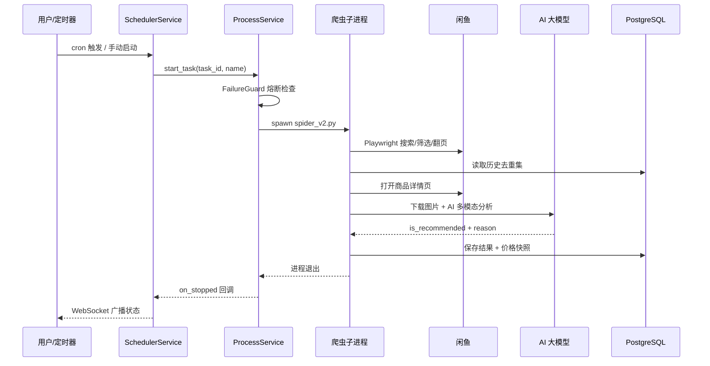

# 架构文档（Architecture）

> 本文档详细描述 `ai-goofish-monitor` 的系统架构：总体设计、分层职责、核心执行链路、数据模型、并发与进程模型、配置体系、前端架构、部署架构与关键设计决策。
>
> 适用于：开发者、架构评审、二次开发。

---

## 目录

1. [总体架构](#一总体架构)
2. [后端分层架构](#二后端分层架构)
3. [运行时进程模型](#三运行时进程模型)
4. [核心执行链路](#四核心执行链路)
5. [数据模型与存储](#五数据模型与存储)
6. [配置体系](#六配置体系)
7. [失败保护与风控处理](#七失败保护与风控处理)
8. [账号与代理轮换](#八账号与代理轮换)
9. [前端架构](#九前端架构)
10. [部署架构](#十部署架构)
11. [关键设计决策](#十一关键设计决策)
12. [架构图汇总](#十二架构图汇总)

---

## 一、总体架构

系统是一个 **FastAPI Web 应用 + Playwright 爬虫子进程** 的组合体，前后端分离、主数据存 PostgreSQL。

```
┌─────────────────────────────────────────────────────────────────────┐
│                           用户（浏览器）                              │
│                   Vue 3 SPA（web-ui/）                               │
└───────────────────────────────┬─────────────────────────────────────┘
                                │ REST /api/*    WebSocket /ws
┌───────────────────────────────▼─────────────────────────────────────┐
│                       FastAPI 后端（src/app.py）                      │
│  ┌──────────────────────────────────────────────────────────────┐   │
│  │  API 路由层  src/api/routes/                                  │   │
│  │  （tasks / results / accounts / collections / dashboard /    │   │
│  │    logs / settings / prompts / login_state / websocket /     │   │
│  │    seller_subscriptions / shop_analytics）                     │   │
│  └──────────────────────────┬───────────────────────────────────┘   │
│                             │ 依赖注入（src/api/dependencies.py）    │
│  ┌──────────────────────────▼───────────────────────────────────┐   │
│  │  服务层  src/services/（28 个模块）                            │   │
│  │  TaskService │ ProcessService │ SchedulerService │            │   │
│  │  AIAnalysisService │ ItemAnalysisDispatcher │                 │   │
│  │  NotificationService │ result_storage_service │               │   │
│  │  collection_service │ price_history_service │ ...             │   │
│  └──────────────────────────┬───────────────────────────────────┘   │
│                             │                                        │
│  ┌──────────────────────────▼───────────────────────────────────┐   │
│  │  领域层  src/domain/                                          │   │
│  │  Task / TaskCreate / TaskUpdate / TaskGenerationJob           │   │
│  │  TaskRepository（接口）                                        │   │
│  └──────────────────────────┬───────────────────────────────────┘   │
│                             │                                        │
│  ┌──────────────────────────▼───────────────────────────────────┐   │
│  │  基础设施层  src/infrastructure/                              │   │
│  │   persistence: psycopg / TaskDbRepository / storage_bootstrap│   │
│  │   config: settings.py / env_manager.py / runtime_status.py   │   │
│  │   external: AIClient / CursorAITransport / 6×通知客户端        │   │
│  └──────────────────────────────────────────────────────────────┘   │
└───────────────────────────────┬─────────────────────────────────────┘
                                │ asyncio.create_subprocess_exec
                                ▼
                    ┌───────────────────────────┐
                    │  爬虫子进程 spider_v2.py   │
                    │  ┌─────────────────────┐ │
                    │  │ Playwright Chromium │ │──→ 闲鱼 goofish.com
                    │  │ 搜索/筛选/翻页/详情  │ │    （MTOP H5 API）
                    │  └─────────────────────┘ │
                    │  ┌─────────────────────┐ │
                    │  │ ItemAnalysisDispatcher│ │──→ 卖家画像 / 图片 / AI 大模型
                    │  └─────────────────────┘ │
                    │  │ 结果写入 PostgreSQL / 通知推送 │
                    └───────────────────────────┘
```

**要点**：
- **主服务（Web + 调度）** 与 **爬虫执行** 分离：Web 服务负责管理、调度、API；爬虫在独立子进程中运行，互不阻塞、互不崩溃影响。
- 前端构建产物（`dist/`）由 FastAPI 直接托管，一条端口搞定前后端。
- 数据单向流动：爬虫子进程写 PostgreSQL，Web 服务读 PostgreSQL 并提供 API。

---

## 二、后端分层架构

项目遵循 **API → Service → Domain → Infrastructure** 的严格分层，依赖方向单向向下，禁止跨层耦合（见 `AGENTS.md`）。

### 2.1 API 层（`src/api/`）

职责：HTTP 协议适配、参数校验、调用服务层、组装响应。

| 路由 | 前缀 | 主要职责 |
|------|------|----------|
| `tasks.py` | `/api/tasks` | 任务 CRUD、启动/停止、AI 生成任务 |
| `results.py` | `/api/results` | 结果列表/详情/导出/黑名单/状态 |
| `accounts.py` | `/api/accounts` | 账号（登录态文件）CRUD |
| `collections.py` | `/api/collections` | 商品收录、SKU 刷新 |
| `dashboard.py` | `/api/dashboard` | 仪表盘汇总 |
| `logs.py` | `/api/logs` | 日志读取（增量/分页）/清空 |
| `settings.py` | `/api/settings` | AI/通知/轮换设置、系统状态 |
| `prompts.py` | `/api/prompts` | 提示词文件管理 |
| `login_state.py` | `/api/login-state` | 根登录态文件读写 |
| `seller_subscriptions.py` | `/api/seller-subscriptions` | 卖家订阅 CRUD、调度、采集、商品/画像查询 |
| `shop_analytics.py` | `/api/shop-analytics` | 订阅日指标看板 `GET /dashboard`；旧 datacompass 概览/分布/趋势/采集保留 |
| `websocket.py` | `/ws` | 实时消息广播 |

**依赖注入**（`src/api/dependencies.py`）：
- `get_task_service()` / `get_notification_service()` / `get_ai_service()` — 每次请求新建
- `get_process_service()` / `get_scheduler_service()` / `get_task_generation_service()` — 全局单例（`app.py` 启动时通过 `set_*` 注入）

### 2.2 服务层（`src/services/`）

职责：承载全部业务逻辑。按功能域可划分为 9 组：

| 分组 | 模块 |
|------|------|
| 任务生命周期 | `task_service`、`task_payloads`、`task_generation_service`、`task_generation_runner`、`task_log_cleanup_service` |
| 进程与调度 | `process_service`、`scheduler_service` |
| AI 分析链 | `ai_service`、`ai_request_compat`、`ai_response_parser`、`item_analysis_dispatcher`、`listing_ai_filter` |
| 商品数据 | `item_sku_fetch_service`、`collection_service`、`seller_profile_cache`、`price_history_service` |
| 搜索抓取 | `search_pagination`、`search_response_selection` |
| 结果存储 | `result_storage_service`、`result_file_service`、`result_blacklist_service`、`result_export_service` |
| 通知系统 | `notification_service`、`notification_config_service` |
| 仪表盘 | `dashboard_service`、`dashboard_payloads` |
| 账号策略 | `account_strategy_service` |
| 卖家订阅 | `seller_subscription_service`、`seller_subscription_storage`、`seller_item_daily_storage`、`shop_analytics_dashboard_storage` |
| 店铺罗盘 | `shop_datacompass_storage`（旧快照；主看板不再读取） |

关键服务职责：

- **TaskService**：任务 CRUD 与状态管理的薄封装，委托给 `TaskRepository`。
- **ProcessService**：爬虫子进程全生命周期管理（启动/停止/监控/日志），含 FailureGuard 熔断检查与生命周期钩子。
- **SchedulerService**：APScheduler（AsyncIOScheduler，时区 `Asia/Shanghai`）定时调度，按 cron 重启任务。
- **AIAnalysisService**：AI 商品分析的业务封装，校验 AI 响应结构。
- **ItemAnalysisDispatcher**：**商品分析编排核心**——用信号量控制并发，将卖家画像、图片下载、多层 AI 判定、结果保存、通知从主抓取循环中解耦异步执行。
- **NotificationService**：并发分发到所有已启用渠道。
- **result_storage_service**：结果记录增删改查、分页、筛选、去重、状态与黑名单。
- **price_history_service**：价格快照与性价比评分。
- **collection_service**：商品收录与 SKU 快照。
- **account_strategy_service**：账号策略规范化与运行时计划解析。
- **seller_subscription_service / seller_subscription_storage**：独立卖家订阅注册、全局 Cron 调度配置、画像与商品指标读写。
- **shop_analytics_dashboard_storage**：跨店日指标 SQL 聚合，供 `GET /api/shop-analytics/dashboard`。
- **shop_datacompass_storage**：卖家工作台 datacompass 快照持久化与查询（首页/旧 API）。

### 2.3 领域层（`src/domain/`）

- **模型**（`models/task.py`）：`Task` 实体（21+ 字段）、`TaskCreate` / `TaskUpdate` / `TaskGenerateRequest` DTO、`TaskStatus` 枚举。内置字段规范化（关键词、cron、价格、区域）与校验（AI 模式需描述、关键词模式需规则、fixed 需账号文件）。
- **生成作业**（`models/task_generation.py`）：`TaskGenerationJob` / `TaskGenerationStep`，描述 AI 辅助创建任务的 6 步进度。
- **仓储接口**（`repositories/task_repository.py`）：`TaskRepository` 抽象基类（find_all / find_by_id / save / delete）。

### 2.4 基础设施层（`src/infrastructure/`）

#### 配置（config/）
- `settings.py`：Pydantic 类型安全配置（兼容 v1/v2），`AISettings` / `NotificationSettings` / `ScraperSettings` / `AppSettings` 四组，提供全局单例与 `reload_settings()`。
- `env_manager.py`：`.env` 文件读写管理器，优先级 `.env` 文件 > 进程环境变量 > 默认值；`update_values` / `apply_changes` 供 Web 设置写回 `.env`。
- `runtime_status.py`：构建不含密钥的运行时配置摘要（供系统状态页）。

#### 持久化（persistence/）
- `database_config.py`：固定 PostgreSQL 驱动，`DATABASE_URL` 标准化。
- `db_connection.py`：`db_connection()` 上下文管理器（psycopg + dict_row），`DbConnection` 支持 `?` / `:name` 参数风格自动转换。
- `sql_dialect.py`：Postgres 方言 SQL 片段（ON CONFLICT 系列）。
- `task_repository.py`：`TaskDbRepository`（Postgres 实现）。
- `task_repository_factory.py`：`create_task_repository()` 工厂（当前返回 Postgres 实现）。
- `json_task_repository.py`：基于 `config.json` 的遗留备用实现。
- `storage_bootstrap.py`：首次启动从 `config.json` / `jsonl/` / `price_history/` 导入历史数据（幂等，带 `app_metadata` 标记 + 线程锁）。
- `storage_names.py`：结果文件名构建与关键词规范化。

#### 外部服务（external/）
- `ai_client.py`：`AIClient` 统一 AI 入口，按 `AI_PROVIDER` 路由到 OpenAI 或 Cursor，内置 API 模式回退与参数降级重试。
- `cursor_transport.py`：`CursorAITransport` 封装 cursor-sdk 桥接调用（文本 + 图片）。
- `notification_clients/`：`NotificationClient` 抽象基类 + `factory.build_notification_clients()` + 6 个渠道实现（ntfy / bark / gotify / wecom / telegram / webhook）。

---

## 三、运行时进程模型

### 3.1 进程拓扑

```
                     FastAPI 主进程（python -m src.app）
   ┌──────────────────────────────────────────────────────────┐
   │  Uvicorn 事件循环                                          │
   │  ├─ SchedulerService（APScheduler AsyncIOScheduler）      │
   │  ├─ WebSocket 广播                                        │
   │  └─ HTTP API handlers                                     │
   └──────────────┬───────────────────────────────────────────┘
                  │ create_subprocess_exec("python -u spider_v2.py --task-name X")
      ┌───────────┴───────────┐
      ▼                       ▼
┌─────────────────┐    ┌─────────────────┐
│ 子进程 任务A      │    │ 子进程 任务B      │
│ spider_v2.py    │    │ spider_v2.py    │
│ └ Playwright    │    │ └ Playwright    │
└─────────────────┘    └─────────────────┘
      （每个运行中的任务一个独立子进程，互不干扰）

   另：卖家订阅采集为独立子进程入口
        python -u spider_v2.py --seller-subscriptions
        （由 SchedulerService.reload_seller_subscription_job 或 API 手动触发）
```

### 3.2 ProcessService 子进程管理细节

- **启动**（`start_task`）：
  1. FailureGuard 熔断检查（`should_skip_start`，暂停中则拒绝启动）
  2. 打开日志文件 `logs/{task_id}_{task_name}.log`
  3. `asyncio.create_subprocess_exec("python", "-u", "spider_v2.py", "--task-name", name, ...)`，stdout/stderr 重定向到日志文件
  4. 环境变量 `PYTHONIOENCODING=utf-8`、`PYTHONUTF8=1`；Unix 下 `os.setsid` 进程组隔离
  5. 注册进程、日志句柄、退出监听协程，触发 `on_started` 钩子 → 同步 `task.is_running=True` → WebSocket 广播 `task_status_changed`
- **停止**（`stop_task`）：Unix `killpg(SIGTERM)` / Windows `terminate()` → 等待最多 20s → 超时强制 SIGKILL → 写入终止标记 → `on_stopped` 钩子。
- **退出监听**：`_watch_process_exit` 协程在子进程退出时清理状态并触发 `on_stopped`，从而保持 `is_running` 与真实进程一致。

### 3.3 爬虫进程内的并发

`spider_v2.py` 在**单进程内用 asyncio 协程并发**多个任务；每个任务协程内部：
- Playwright 浏览器实例独立（每任务一个 context）
- 商品分析通过 `ItemAnalysisDispatcher` 以信号量（默认并发 2）异步分发，主循环不阻塞等待 AI
- 商品详情页逐条串行打开（间隔 5–10 秒，反风控）

### 3.4 WebSocket 实时通道

- 前端 `ws://host/ws` 建立连接，服务端 `broadcast_message(type, data)` 广播。
- 事件：`task_status_changed`（任务启停）、`tasks_updated`、`results_updated`（前端据此实时刷新）。
- 断线自动重连（3 秒）。

---

## 四、核心执行链路

### 4.1 任务创建链路（两种模式）

```
[AI 生成模式]  POST /api/tasks/generate（decision_mode=ai）
  → TaskGenerationService.create_job()（生成 job_id，返回 202）
  → 后台守护线程执行 run_ai_generation_job()
       ├─ prompt_utils.generate_criteria(description, 参考范例)  → AI 生成分析标准
       ├─ 保存到 prompts/{keyword}_criteria.txt
       ├─ TaskService.create_task() 创建任务
       └─ SchedulerService.reload_jobs()
  → 前端轮询 GET /api/tasks/generate-jobs/{job_id} 展示 6 步进度

[关键词模式]  POST /api/tasks/generate（decision_mode=keyword）
  → 直接 TaskService.create_task()，返回 200 + 任务对象

[普通创建]    POST /api/tasks/（直接指定全部字段）
```

### 4.2 任务运行链路

```
SchedulerService 触发（cron） 或 用户点击启动（/api/tasks/start/{id}）
  → ProcessService.start_task()
       → spider_v2.py --task-name X（子进程）
            → scrape_xianyu(task_config)
                 → 账号/代理选择 → FailureGuard 检查 → Playwright 启动
                 → 搜索 + 筛选 + 分页 + 详情 + 卖家信息
                 → ItemAnalysisDispatcher.submit()（异步分析）
            → analysis_dispatcher.join() 等全部完成 → 清理临时图片
       → 子进程退出
  → on_stopped 钩子 → is_running=False → WebSocket 广播
```

### 4.2b 卖家订阅采集链路

```
Cron（seller_subscription_schedule）或 POST /api/seller-subscriptions/run
  → ProcessService.start_seller_subscription_job()
       → spider_v2.py --seller-subscriptions
            → seller_subscription_scraper（C 端个人主页 MTOP API）
            → 过滤：同时有 want_count + view_count 才入库
            → seller_profiles（按日 UPSERT）
              + seller_subscription_items / seller_item_daily_metrics / crawl_raw_records
```

### 4.2c 店铺分析看板（订阅日指标）

```
ShopAnalyticsView
  → GET /api/shop-analytics/dashboard?period=today|7d
       → shop_analytics_dashboard_storage
            → seller_item_daily_metrics + seller_subscriptions + seller_profiles
```

主页面只打 `/dashboard`。旧 datacompass 链路（`POST /collect` → `shop_datacompass_snapshots` → `GET /overview|/flow|/distribution|/trend`）保留给兼容与首页，不再作为本页主状态。

### 4.2d 店铺数据罗盘采集链路（可选）

```
用户创建 task_type=shop_datacompass 任务并启用
  → POST /api/shop-analytics/collect 或 Cron 启动
       → spider_v2.py --task-name X
            → scraper_shop_datacompass（seller.goofish.com datacompass API）
            → shop_datacompass_snapshots
  → 旧 GET /overview|/flow|/distribution|/trend 仍可读快照；主页面不再调用
```

### 4.3 爬虫抓取生命周期（scraper.py）

1. **初始化**：读取任务配置；加载历史处理链接（去重）；加载价格历史；构建账号/代理轮换池；解析账号策略。
2. **失败保护**：`FAILURE_GUARD.should_skip_start()`，暂停中直接返回。
3. **浏览器启动**：Chromium + 反检测参数（`--disable-blink-features=AutomationControlled` 等）；移动端上下文模拟（UA、视口 412×915、上海地理位置）；注入反检测 init_script（移除 webdriver 标识等）；增强快照覆盖（env/headers）。
4. **搜索（步骤 0-1）**：访问首页随机滚动 → 导航 `https://www.goofish.com/search?q={keyword}` → 等待搜索 MTOP API 响应 → 登录页检测（`LoginRequiredError`）/ 验证弹窗检测（`RiskControlError`）→ 关闭广告弹窗。
5. **筛选（步骤 2）**：按 `new_publish_option` → `personal_only` → `free_shipping` → `region`（省市区）→ 价格区间，每步点击后等待搜索 API。
6. **分页遍历**：`choose_search_response_for_parse`（选择 resultList 非空的响应）→ 解析商品列表 → 记录价格快照 → 逐条处理：详情页 → 详情 API → `FAIL_SYS_USER_VALIDATE` 风控检查 → 提取 itemDO/sellerDO/图片/芝麻信用/注册时长/想要人数 → 构建 `final_record` → 提交分析 → 商品间延迟 5–10s → 翻页（`advance_search_page`）→ 页间休息 10–15s。
7. **收尾**：`dispatcher.join()` → 关闭浏览器 → `record_success`/`record_failure` → 清理临时图片目录。

### 4.4 单商品分析链（ItemAnalysisDispatcher）

```
final_record
  ├─ (1) 加载卖家画像  seller_profile_cache.get_or_load(user_id, scrape_user_profile)
  │        → parse_user_head_data（昵称/信用/头像）
  │        → 滚动采集在售商品 + 评价（parse_ratings_data → calculate_reputation）
  │        → 合并芝麻信用 + 注册时长（format_registration_days）
  ├─ (2) 判定链（短路，命中即返回）：
  │    a. decision_mode=keyword → keyword_rule_engine.evaluate_keyword_rules()
  │    b. heuristic_listing_filter：纯规则（如"仅数据线"→ 过滤）
  │    c. filter_listing_by_ai：轻量 AI 品类门禁（下载 ≤2 张图）
  │    d. ai_analyzer：下载全部图片 → AI 多模态分析（重试 ≤4 次）
  │    e. skip_ai_analysis → 全部推荐
  ├─ (3) saver：result_storage_service.save_result_record()
  │        + price_history_service.record_market_snapshots()
  └─ (4) 若推荐 → notifier：notification_service.send_notification()
```

**`ItemAnalysisJob` 数据类**携带：keyword、task_name、decision_mode、analyze_images、prompt_text、keyword_rules、final_record、seller_id、芝麻信用、注册时长、purchase_intent、enable_ai_listing_filter。

### 4.5 AI 响应验证

`ai_handler.validate_ai_response_format` 要求响应 JSON 必须包含：
- `prompt_version`（str）
- `is_recommended`（bool）
- `reason`（str）
- `risk_tags`（list）
- `criteria_analysis`（非空 dict，须含 `seller_type`）

验证失败/解析失败/空响应 → 自动重试（最多 4 次，temperature 从 0.1 降至 0.05）。

### 4.6 AI 请求兼容层（ai_request_compat.py）

解决不同大模型网关的兼容性问题，`AIClient._call_ai` 内实现最多 4 次的重试/降级策略：

| 场景 | 处理 |
|------|------|
| Responses API 404 | 回退 Chat Completions |
| Chat Completions 404 | 回退 Responses API |
| 不支持 `response_format`（JSON 输出） | 移除后重试 |
| 不支持 `temperature` | 移除后重试 |
| 空响应 | 重试 |
| 模型支持 thinking | `extra_body={"enable_thinking": ...}` 透传 |

### 4.7 通知链路

```
商品 is_recommended=True
  → notification_service.send_notification(product_data, reason)
       → 并发调用所有 is_enabled() 的渠道客户端
            ├─ ntfy    POST 文本 + Title/Priority/Tags 头
            ├─ bark    POST JSON {title, body, url, level, group}
            ├─ gotify  POST multipart 到 {url}/message?token=
            ├─ wecom   POST JSON markdown，校验 errcode
            ├─ telegram POST sendMessage HTML
            └─ webhook GET/POST 自定义 headers/query/body（支持 {{title}} 等模板变量）
       → 返回 {channel: {success, message}}
```

统一消息模型 `NotificationMessage`：title / price / reason / desktop_link / mobile_link / notification_title（带 emoji 截断 30 字）/ content / image_url。

---

## 五、数据模型与存储

### 5.1 存储策略总览

| 数据 | 存储 | 说明 |
|------|------|------|
| 任务 | PostgreSQL `tasks` 表 | 主数据 |
| 爬取结果 | PostgreSQL `result_items` 表 | 主数据 |
| 价格快照 | PostgreSQL `price_snapshots` 表 | 行情 |
| 收录/SKU | PostgreSQL `collected_items` 表 | 收藏 |
| 黑名单 | PostgreSQL `result_blacklist_rules` 表 | 按结果文件 |
| 元数据 | PostgreSQL `app_metadata` 表 | bootstrap 标记等 |
| 卖家订阅 | PostgreSQL `seller_subscriptions` + `seller_subscription_schedule` | 独立注册表 |
| 卖家画像 | PostgreSQL `seller_profiles`（`profile_day` 日级） | 订阅卖家画像 |
| 商品静态/日指标/原始 | `seller_subscription_items` + `seller_item_daily_metrics` + `crawl_raw_records` | 日级 1:1 关联 |
| 商品指标（遗留） | PostgreSQL `seller_item_metrics` | 只读兼容，新写入已停用 |
| 店铺罗盘 | PostgreSQL `shop_datacompass_snapshots` | 工作台 datacompass |
| 登录态 | `state/*.json` 文件 | 多账号 |
| Prompt | `prompts/*.txt` 文件 | 可 Web 编辑 |
| 日志 | `logs/*.log` 文件 | 按任务 |
| 图片 | `images/` 目录 | 临时/缓存 |

### 5.2 表结构

#### tasks（任务配置，22 列）

| 字段 | 类型 | 说明 |
|------|------|------|
| id | BIGINT IDENTITY PK | 任务 ID |
| task_name | TEXT NOT NULL | 任务名 |
| enabled | BOOLEAN 默认 TRUE | 是否启用 |
| keyword | TEXT NOT NULL | 搜索关键词 |
| description | TEXT | 购买需求描述 |
| analyze_images | BOOLEAN 默认 TRUE | 是否分析图片 |
| max_pages | INTEGER 默认 3 | 最大翻页数 |
| personal_only | BOOLEAN 默认 TRUE | 仅个人卖家 |
| min_price / max_price | TEXT | 价格区间 |
| cron | TEXT | Cron 表达式 |
| ai_prompt_base_file | TEXT 默认 prompts/base_prompt.txt | 基础提示词 |
| ai_prompt_criteria_file | TEXT | 判定标准提示词 |
| account_state_file | TEXT | 绑定账号文件 |
| account_strategy | TEXT 默认 auto | auto/fixed/rotate |
| free_shipping | BOOLEAN 默认 TRUE | 包邮筛选 |
| new_publish_option | TEXT | 新发布筛选 |
| region | TEXT | 省市区 |
| decision_mode | TEXT 默认 ai | ai/keyword |
| keyword_rules_json | JSONB 默认 [] | 关键词规则 |
| is_running | BOOLEAN 默认 FALSE | 运行状态 |
| task_type | TEXT 默认 keyword_search | keyword_search / seller_subscription / shop_datacompass |
| seller_user_ids_json | JSONB 默认 [] | 任务型卖家订阅 ID 列表（遗留） |
| seller_urls_json | JSONB 默认 [] | 卖家 URL 列表 |
| collect_ratings | BOOLEAN 默认 FALSE | 是否采集评价 |

#### seller_subscriptions / seller_subscription_schedule

独立卖家订阅注册表与全局调度（单行配置：cron、item_limit、账号策略）。推荐 Web UI 走此路径，而非 tasks 表的 `task_type`。

#### seller_profiles / seller_subscription_items / seller_item_daily_metrics / crawl_raw_records

卖家订阅日级数据模型（`snapshot_day` / `profile_day` 均为 **Asia/Shanghai** 自然日）：

| 表 | 职责 | 粒度 |
|----|------|------|
| `seller_profiles` | 卖家画像；同日 UPSERT 覆盖 | `(task_name, seller_user_id, profile_day)` |
| `seller_subscription_items` | 商品静态主表（title/price/status/link） | `(task_name, seller_user_id, item_id)` |
| `crawl_raw_records` | 通用爬虫原始 JSON（仅 `created_at`/`updated_at`/`raw_json`） | 每条日指标 1 行 |
| `seller_item_daily_metrics` | 日指标 want/view；`raw_record_id` **UNIQUE FK** → `crawl_raw_records` | `(task_name, seller_user_id, item_id, snapshot_day)` |

同日多次采集：更新 `crawl_raw_records.raw_json` + `updated_at` 与日指标列，**不新增** raw 行（保持 1:1）。  
`seller_item_metrics` / 卖家订阅路径的 `result_items` 写入已停用；历史可用 `python scripts/backfill_seller_item_daily.py` 回填。

#### shop_datacompass_snapshots

卖家工作台 datacompass API 快照（按 account_state_file + time_cycle + snapshot_date + api_name 唯一）。

#### result_items（结果主表）

关键字段：`result_filename`、`keyword`、`task_name`、`crawl_time`、`publish_time`、`price`、`price_display`、`item_id`、`title`、`link`、`link_unique_key`（**去重键**）、`seller_nickname`、`is_recommended`、`analysis_source`（ai/keyword/ai_filter）、`keyword_hit_count`、`status`（active/hidden/expired）、`raw_json`（完整原始 JSON）。
唯一约束：`(result_filename, link_unique_key)`。

**去重键规则**：有链接取 URL 首个 `&` 之前部分；无链接有商品 ID 用 `item:{id}`；都没有则对整条记录 SHA-1 哈希。

#### price_snapshots（价格快照）

字段：`keyword_slug`、`keyword`、`task_name`、`snapshot_time`、`snapshot_day`、`run_id`、`item_id`、`title`、`price`、`price_display`、`tags_json`、`region`、`seller`、`publish_time`、`link`。唯一约束 `(keyword_slug, run_id, item_id)`。

#### collected_items（收录）

字段：`id`、`result_item_id`（FK → result_items, ON DELETE CASCADE）、`collected_at`、`sku_fetch_status`（pending/running/done/failed）、`sku_fetched_at`、`sku_json`、`sku_error`。

#### result_blacklist_rules / app_metadata

- 黑名单：`result_filename` PK + `blacklist_keywords_json` + `updated_at`。
- 元数据：`key` PK + `value`。

### 5.3 索引

- `tasks(task_name)`
- `result_items(result_filename, crawl_time DESC)` / `(…, publish_time DESC)` / `(…, price DESC)` / `(…, is_recommended, analysis_source, crawl_time DESC)` / `(…, status, crawl_time DESC)`
- `price_snapshots(keyword_slug, snapshot_time DESC)` / `(keyword_slug, item_id, snapshot_time DESC)`
- `collected_items(collected_at DESC)`

### 5.4 RLS

所有表启用 RLS 但**未定义任何策略**：PostgREST/Supabase Data API 默认拒绝；后端通过 Database 连接串（superuser 角色）读写不受限制。

### 5.5 首次启动引导（storage_bootstrap）

表为空时从遗留文件导入一次（幂等，`app_metadata` 打标）：
1. `config.json` → `tasks`
2. `jsonl/*.jsonl` → `result_items`
3. `price_history/*_history.jsonl` → `price_snapshots`

### 5.6 历史迁移

`python3 -m scripts.migrate_sqlite_to_postgres` 可将旧 SQLite（`data/app.sqlite3`）一次性迁入 Postgres，保留主键 ID（`OVERRIDING SYSTEM VALUE`）并重置序列。

---

## 六、配置体系

### 6.1 配置读取优先级

```
.env 文件（env_manager 优先）  >  进程环境变量（如 Cursor Secrets）  >  代码默认值
```

### 6.2 配置模块

| 模块 | 内容 |
|------|------|
| `src/infrastructure/config/settings.py` | 新架构 Pydantic 配置：`AISettings` / `NotificationSettings` / `ScraperSettings` / `AppSettings`；全局单例 + `reload_settings()` |
| `src/infrastructure/config/env_manager.py` | `.env` 读写（Web 设置页保存时写回 `.env`） |
| `src/infrastructure/config/runtime_status.py` | 运行时配置摘要（脱敏） |
| `src/config.py` | 遗留兼容层：模块级常量 + `os.getenv()`，供爬虫等旧代码使用 |

> ⚠️ 注意两套配置并存的历史现状：新代码用 `settings.py`，爬虫/解析器仍可能用 `config.py` 模块级常量。两者同源（`.env`），但类型安全级别不同。

### 6.3 主要环境变量分组

| 分组 | 变量 |
|------|------|
| AI | `AI_PROVIDER`、`OPENAI_API_KEY`、`OPENAI_BASE_URL`、`OPENAI_MODEL_NAME`、`CURSOR_API_KEY`、`CURSOR_MODEL_NAME`、`CURSOR_RUNTIME`、`CURSOR_LOCAL_CWD`、`CURSOR_CLOUD_REPOS`、`PROXY_URL`、`AI_DEBUG_MODE`、`ENABLE_THINKING`、`ENABLE_RESPONSE_FORMAT`、`SKIP_AI_ANALYSIS` |
| 通知 | `NTFY_TOPIC_URL`、`BARK_URL`、`WX_BOT_URL`、`TELEGRAM_BOT_TOKEN`、`TELEGRAM_CHAT_ID`、`TELEGRAM_API_BASE_URL`、`GOTIFY_URL`、`GOTIFY_TOKEN`、`WEBHOOK_URL`、`WEBHOOK_METHOD`、`WEBHOOK_HEADERS`、`WEBHOOK_CONTENT_TYPE`、`WEBHOOK_QUERY_PARAMETERS`、`WEBHOOK_BODY`、`PCURL_TO_MOBILE` |
| 数据库 | `DATABASE_URL` |
| 爬虫 | `RUN_HEADLESS`、`LOGIN_IS_EDGE`、`PCURL_TO_MOBILE`、`STATE_FILE`、`ACCOUNT_STATE_DIR` |
| Web | `SERVER_PORT`、`WEB_USERNAME`、`WEB_PASSWORD` |
| 失败保护 | `TASK_FAILURE_THRESHOLD`（默认 3）、`TASK_FAILURE_PAUSE_SECONDS`（默认 86400）、`TASK_FAILURE_GUARD_PATH`、`TASK_FAILURE_TZ` |
| 轮换 | `ACCOUNT_ROTATION_ENABLED`、`ACCOUNT_ROTATION_MODE`、`ACCOUNT_ROTATION_RETRY_LIMIT`、`ACCOUNT_BLACKLIST_TTL`、`PROXY_ROTATION_ENABLED`、`PROXY_ROTATION_MODE`、`PROXY_POOL`、`PROXY_ROTATION_RETRY_LIMIT`、`PROXY_BLACKLIST_TTL` |
| 其他 | `TASK_LOG_RETENTION_DAYS`（默认 7）、`AI_LISTING_FILTER_ENABLED`（默认 true）、`SPIDER_DEBUG_LIMIT`、`IMAGE_DOWNLOAD_CONCURRENCY` |

完整清单与默认值见[功能文档 → 配置项](../features.md)。

---

## 七、失败保护与风控处理

### 7.1 FailureGuard 熔断器（src/failure_guard.py）

解决"登录态失效/风控导致任务持续失败 → 无限重试 → 加剧风控"的问题。

- **状态文件**：`logs/task-failure-guard.json`（原子写入：`.tmp` + `fsync` + `os.replace`；`fcntl` 文件锁保护多进程）。
- **阈值**：连续失败 ≥ `TASK_FAILURE_THRESHOLD`（默认 3）→ 熔断暂停 `TASK_FAILURE_PAUSE_SECONDS`（默认 24h）。
- **每日通知去重**：熔断/失败每天最多通知一次。
- **自动恢复**：检测到绑定 Cookie 文件 mtime 变化 → 自动重置失败计数继续运行。
- **损坏容错**：JSON 损坏时备份为 `.corrupt.{ts}` 并重建。

### 7.2 风控信号与处理

| 信号 | 处理 |
|------|------|
| `div.baxia-dialog-mask` / `div.J_MIDDLEWARE_FRAME_WIDGET`（验证弹窗） | 立即中止，抛 `RiskControlError` |
| API 返回 `FAIL_SYS_USER_VALIDATE` | 随机休眠 3–60s 后安全退出，抛 `RiskControlError` |
| 重定向到 `passport.goofish.com` / `mini_login` | 抛 `LoginRequiredError` |

风控错误**不触发**账号轮换重试（避免无意义尝试）。

### 7.3 反检测策略

- 浏览器启动参数：`--disable-blink-features=AutomationControlled`、`--no-sandbox`、`--disable-web-security` 等
- 注入 init_script：移除 `navigator.webdriver`、模拟 `plugins`/`languages`/`chrome`、触摸支持、权限查询覆盖
- 移动端上下文：UA、视口 412×915、上海经纬度、时区
- Chrome 扩展增强快照：应用 `env`（navigator/screen/intl）与 `headers`
- 随机化行为：首页随机滚动、翻页后随机等待 2–5s、商品间延迟 5–10s、页间 10–15s

---

## 八、账号与代理轮换

### 8.1 账号策略（account_strategy_service）

| 策略 | 行为 |
|------|------|
| `auto` | 有根 `xianyu_state.json` 优先用根文件，否则用账号池 |
| `fixed` | 固定使用 `account_state_file` 指定账号 |
| `rotate` | 从 `state/` 目录账号池轮换 |

### 8.2 轮换池（rotation.py RotationPool）

- `pick_random()`：从可用项随机选取
- `mark_bad()`：失败项加入黑名单（TTL 后自动恢复，默认 300s）
- 模式：`per_task`（任务开始选一次全程复用）/ `on_failure`（失败才轮换）

### 8.3 卖家画像缓存（seller_profile_cache）

`SellerProfileCache`：TTL 30 分钟 + 并发请求合并（同一 user_id 并发共享一次加载）+ `asyncio.Lock` 原子性 + 深拷贝防污染。

---

## 九、前端架构

### 9.1 设计模式

- **无集中式状态库**：用组合式函数（Composables）+ 模块级 `ref/reactive` 闭包状态。
- **实时性**：WebSocket 单例服务推送 `tasks_updated` / `results_updated` / `task_status_changed`，各 composable 监听后刷新本地状态。
- **HTTP 封装**：`lib/http.ts` 统一处理 401（自动登出）、错误提取、query 序列化。

### 9.2 数据流

```
组件（Views） → Composables（useTasks/useResults/...） → api/*.ts → http() → 后端 /api/*
                                      ↑
                              WebSocket /ws（实时推送）
```

### 9.3 模块划分

| 层 | 职责 |
|----|------|
| `views/` | 13 个页面（含卖家订阅 5 路由 + 店铺分析看板） |
| `components/` | 业务组件（TaskForm、TasksTable、ResultCard、ResultsFilterBar、NotificationSettingsPanel 等）+ shadcn-vue 基础组件 |
| `composables/` | useAuth/useTasks/useResults/useDashboard/useSettings/useLogs/useWebSocket/useTaskGenerationJob/useMobileNav |
| `api/` | tasks/results/accounts/dashboard/logs/settings/prompts/collections/sellerSubscriptions/shopAnalytics |
| `lib/` | http.ts（请求封装）、taskFormQuery.ts、taskSchedule.ts（14 种 cron 预设）、utils.ts |
| `services/websocket.ts` | WS 客户端（自动重连、事件总线） |
| `types/` | 前后端接口对齐的 TS 类型 |
| `i18n/` | zh-CN / en-US |

### 9.4 认证

- 登录：`POST /auth/status` 校验账号密码 → localStorage 保存登录态 → 启动 WebSocket
- 路由守卫：未登录访问受保护页 → 跳 `/login?redirect=...`；已登录访问 `/login` → 跳 Dashboard
- 自动登出：任意 API 401 → `logout()`

### 9.5 关键前端交互

- **任务创建**：AI 模式提交后返回 job → 进度弹窗轮询 6 步生成状态
- **结果页**：文件下拉 + 筛选（AI/关键词推荐互斥）+ 排序 + 分页 + 洞察面板（价格趋势 SVG）+ 卡片操作（收藏/屏蔽/打开）
- **日志页**：增量轮询 + 向上分页加载历史 + 自动滚动 + 防膨胀截断
- **设置页**：5 个 Tab（AI/轮换/通知/状态/提示词），敏感字段不回显、分渠道测试

---

## 十、部署架构

### 10.1 部署形态

| 形态 | 方式 | 适用 |
|------|------|------|
| Docker 单容器 | `docker compose up -d`，镜像内置 Chromium | 生产推荐 |
| 本地一键 | `./start.sh`（装依赖 → 构建前端 → 启动后端） | 开发/试用 |
| 手动 | `python -m src.app` + `cd web-ui && npm run dev` | 开发 |
| 纯前端 | `web-ui/Dockerfile`（Nginx） | 前后端分离场景 |
| 桌面打包 | `desktop_launcher.py`（PyInstaller） | 本地桌面 |

### 10.2 Docker 镜像体系

```
Dockerfile.base（python:3.11-slim-bookworm）
   ├─ venv + requirements-runtime.txt
   ├─ tzdata / tini（PID1）/ libzbar0
   └─ playwright install chromium（含系统依赖）
        ↓ 基础镜像：ghcr.io/usagi-org/ai-goofish-base:latest
Dockerfile.release
   ├─ Stage1: node:22-alpine → web-ui 构建
   └─ Stage2: 基础镜像 + dist + src + spider_v2.py + prompts
        ↓ 发布镜像：ghcr.io/usagi-org/ai-goofish:latest
Dockerfile（本地完整三阶段构建，docker compose up --build）
```

- 多架构：CI 用 Buildx + QEMU 构建 `linux/amd64` / `linux/arm64`
- CI 触发：`workflow_dispatch` 或 PR 合入 `master`
- 持久化卷：`state/`、`config.json`、`prompts/`、`jsonl/`、`logs/`、`images/`、`price_history/`
- 数据库外部化：通过 `.env` 的 `DATABASE_URL` 连接 Supabase/自建 Postgres

### 10.3 本地开发数据库

`docker-compose.dev.yml` 提供 Postgres 16（`postgres/goofish@127.0.0.1:5432/goofish`），首次启动自动执行迁移 SQL。

### 10.4 网络拓扑（前端独立部署时）

```
浏览器 → Nginx（静态资源 + SPA 回退）
            ├─ /api/* → app:8000
            ├─ /auth  → app:8000
            ├─ /static → app:8000
            └─ /ws    → app:8000（WebSocket Upgrade）
```

---

## 十一、关键设计决策

| 决策 | 理由 / 权衡 |
|------|-------------|
| **爬虫放子进程而非线程** | 进程隔离避免崩溃影响主服务；Playwright 每任务独立浏览器互不干扰；可通过日志文件追踪。代价：进程调度开销。 |
| **存储主数据用 PostgreSQL 而非文件** | 多进程安全、可并发查询、支撑 Web UI 的分页/筛选/排序、SQLite 时代的分页是全量内存扫描。 |
| **判定链分层短路** | 关键词（零成本）→ 启发式（零成本）→ AI 门禁（2 图轻量）→ 完整 AI（全图），把高成本步骤放在最后，显著降低 AI 调用量。 |
| **AI 双提供方抽象** | `AIClient` 统一入口 + `AI_PROVIDER` 切换，OpenAI 兼容网关与 Cursor SDK 互不影响。 |
| **AI 请求兼容层** | 大模型网关参数差异大（response_format/temperature/API 模式），用重试降级代替人工适配每种网关。 |
| **异步分析解耦** | `ItemAnalysisDispatcher` 信号量限流 + 后台分析，主抓取循环不等待 AI，吞吐更高；并发数可配。 |
| **失败熔断 + 自动恢复** | 用 Cookie mtime 感知"用户已更新登录态"并自动放行，兼顾稳定与易用。 |
| **配置双轨并存** | 新代码走 Pydantic settings、旧代码走模块级常量，属于演进中状态；新代码应优先用 settings。 |
| **前端无状态库** | 项目规模下 Composables 足够，避免引入 Pinia 的心智与样板成本。 |
| **RLS 空策略** | 业务数据仅由后端连接串读写，PostgREST 默认拒绝，安全面收敛到后端。 |
| **tini 作为 PID1** | 容器内正确处理信号与僵尸进程回收。 |

---

## 十二、架构图汇总

### 12.1 任务运行时序



### 12.2 请求-处理全景（数据流）

```
搜索 API 响应 ──search_response_utils──> 商品列表
    └─parsers._parse_search_results_json─> 基础商品记录
详情 API 响应 ──item_detail_parser──> SKU / itemDO / sellerDO
    └─ 图片下载 ──> 本地文件 ──> AI 分析
卖家主页 API ──parsers──> 卖家画像（信用/评价）
    └─seller_profile_cache──> 缓存复用
分析结果 ──> result_storage_service ──> result_items 表
    └─> notification_service ──> ntfy/bark/wecom/telegram/gotify/webhook
    └─> price_history_service ──> price_snapshots 表
Web UI 查询 ──> result_storage_service 分页/筛选 ──> result_file_service 价格洞察 ──> 前端渲染
```

---

## 附：关键文件速查

| 关注点 | 文件 |
|--------|------|
| 应用入口 / 生命周期 | `src/app.py` |
| 爬虫核心 | `src/scraper.py` |
| 爬虫 CLI | `spider_v2.py` |
| 分析编排 | `src/services/item_analysis_dispatcher.py` |
| AI 调用 | `src/ai_handler.py`、`src/infrastructure/external/ai_client.py` |
| 任务实体/校验 | `src/domain/models/task.py` |
| 任务仓储 | `src/infrastructure/persistence/task_repository.py` |
| 子进程管理 | `src/services/process_service.py` |
| 定时调度 | `src/services/scheduler_service.py` |
| 失败熔断 | `src/failure_guard.py` |
| 轮换 | `src/rotation.py`、`src/services/account_strategy_service.py` |
| 结果存储 | `src/services/result_storage_service.py` |
| 价格洞察 | `src/services/price_history_service.py` |
| 通知 | `src/services/notification_service.py`、`src/infrastructure/external/notification_clients/` |
| 配置 | `src/infrastructure/config/settings.py`、`src/config.py` |
| 数据库 Schema | `supabase/migrations/20260803120000_initial_goofish_schema.sql` |
| 前端路由 | `web-ui/src/router/index.ts` |
| 前端状态 | `web-ui/src/composables/` |
