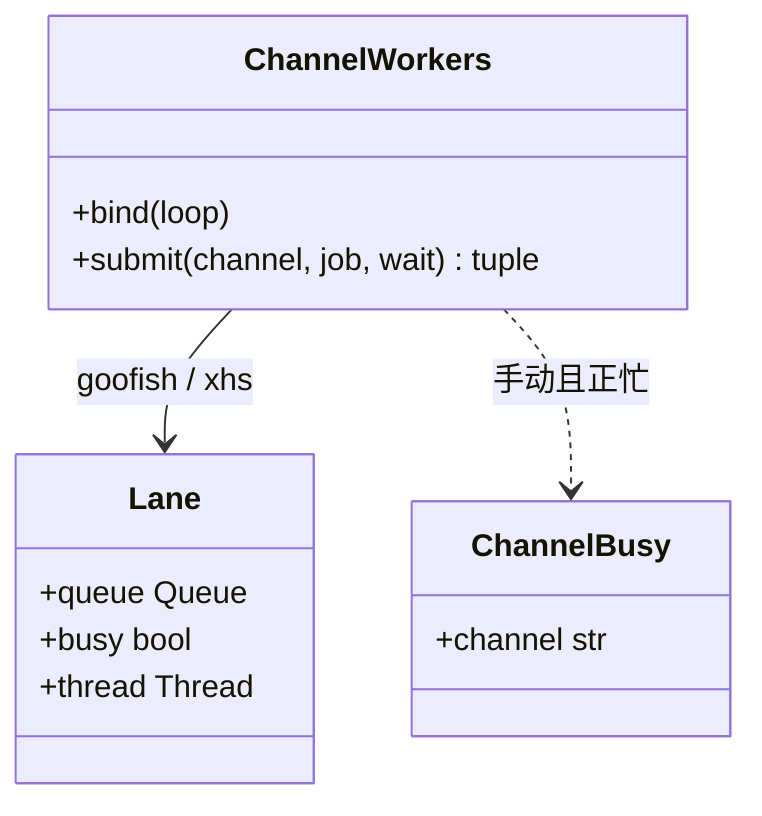
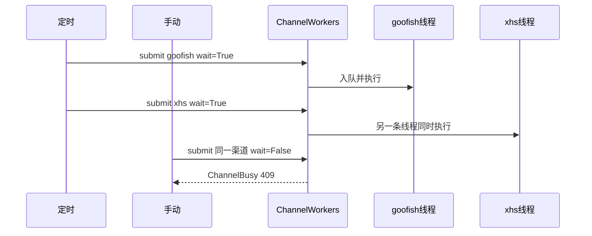

# 多渠道并行执行

> **对应 PRD**：[多渠道并行执行](../prd/channel-execution.md)  
> **改执行顺序先改这篇，再改代码。**

一条渠道等于一套爬虫资源。每个渠道一个队列、一条工作线程。同渠道排队，跨渠道并行。健康度周判定只查库，不进渠道。

## 1. 实现思路

闲鱼是 `spider_v2.py` 子进程（Playwright + 登录态）。小红书在 API 进程里用另一个浏览器打开公开页，不加载闲鱼或小红书登录态，读渲染后的已售。两者不能共用一条执行线。

现在有两处缠绕：

- `ProcessService.start_task` 只按任务 ID 防重入。两个闲鱼任务的 Cron 撞在一起时，会同时开两个浏览器。
- `SchedulerService._run_xhs` 在事件循环里同步调用 `collect_products()`。小红书这一轮没结束，到期的闲鱼任务也启动不了。

做法：`ChannelWorkers` 为每个已注册渠道起一条守护线程和一个 `queue.Queue`。闲鱼任务用 `asyncio.run_coroutine_threadsafe` 交回主事件循环拉起子进程，工作线程等到进程退出才取下一个。小红书的浏览器在自己的渠道线程里打开（`on_thread=True`），不进事件循环，也不进 `asyncio.to_thread`。Playwright 的同步接口放进线程池时仍会拖住主循环，页面请求会一直等到这轮采集结束。

定时触发使用 `wait=True`：渠道忙也入队，调度协程等到这一次执行结束才返回，因此同一个 APScheduler job 的 `max_instances=1` 仍然挡住重复入队。手动触发使用 `wait=False`：渠道忙则立刻抛 `ChannelBusy`，HTTP 409，文案「该渠道正在采集」，不把请求挂到整轮结束。

## 2. 类图

`submit` 返回 `("started" | "queued", Future)`。`Future` 在这次 job 结束时完成。未知渠道抛 `ValueError`。

## 3. 时序

闲鱼 job：主循环 `start_task` 或 `start_seller_subscription_job`，成功后再 `wait_until_exit`。小红书 job：渠道线程里直接调用 `collect_products`。关键词任务、卖家订阅、店铺罗盘都进 `goofish`。

## 4. 接入新渠道

1. 在 `ChannelWorkers` 注册渠道名，并写明它占用的爬虫资源。
2. 定时入口和手动入口只调用 `submit(渠道名, ...)`，不要在调度函数里再写一套等待。
3. 补一条测试：与已有渠道可以同时开始，该渠道自身第二次不会重叠。
4. 更新本篇的渠道表，再改代码。

本轮不实现第三个渠道。

## 5. 文件

| 路径 | 动作 |
|------|------|
| `src/services/channel_workers.py` | 新增 |
| `src/services/process_service.py` | `wait_until_exit` |
| `src/services/scheduler_service.py` | 定时入口入队 |
| `src/api/routes/tasks.py` | 手动关键词 / 罗盘任务 |
| `src/api/routes/seller_subscriptions.py` | 手动卖家订阅 |
| `src/api/routes/shop_analytics.py` | 手动店铺罗盘 |
| `src/api/routes/xhs.py` | 手动公开页采集 |
| `src/app.py` | 启动时绑定事件循环 |
| `tests/unit/test_channel_workers.py` | 新增 |

## 6. 任务列表

| ID | 名称 | 源文件 | 依赖 | 优先级 |
|----|------|--------|------|--------|
| T01 | 渠道注册表与两条工作线程 | `src/services/channel_workers.py`、`process_service.py` | 无 | P0 |
| T02 | 闲鱼定时与手动入口接入 goofish | `scheduler_service.py`、`tasks.py`、`seller_subscriptions.py`、`shop_analytics.py`、`app.py` | T01 | P0 |
| T03 | 小红书定时与手动入口接入 xhs | `scheduler_service.py`、`xhs.py` | T01 | P0 |
| T04 | 同渠道排队与跨渠道并行测试 | `tests/unit/test_channel_workers.py` | T01 | P0 |
| T05 | 文档同步 | `architecture.md`、`features.md`、`user-guide.md`、`log.md` | T02、T03 | P0 |

不引入新的第三方包。

## 7. 默认假设

- 定时 FIFO 入队，不丢这一枪。同一任务不排两遍，靠 `max_instances=1`。
- 手动忙线只返回可读文案，HTTP 409。
- 不按闲鱼账号拆线。
