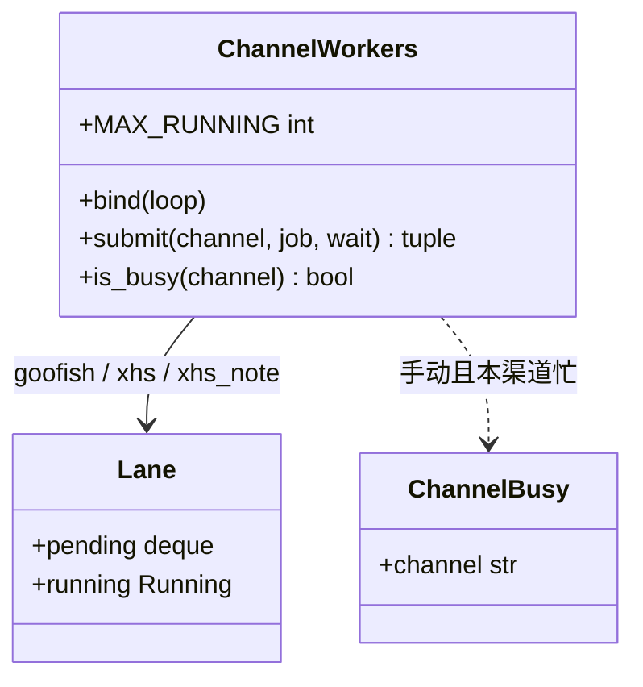
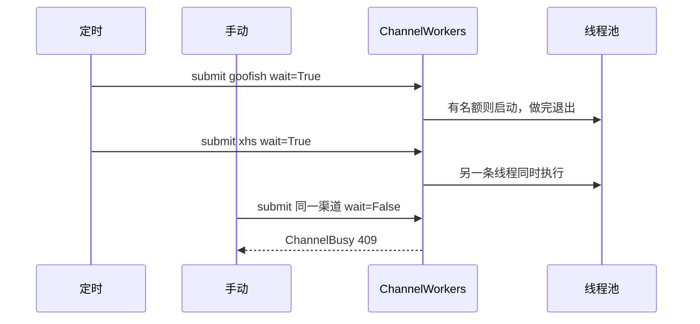

# 多渠道并行执行

> **对应 PRD**：[多渠道并行执行](../prd/channel-execution.md)  
> **改执行顺序先改这篇，再改代码。**

一条渠道等于一套爬虫资源，也等于一个队列。线程是共用的池子，不是每个渠道一条常驻线程。同渠道串行，不同渠道在池子有名额时并行。健康度周判定只查库，不进渠道。

## 1. 实现思路

闲鱼是 `spider_v2.py` 子进程（Playwright + 登录态）。小红书商品在池线程里用另一个浏览器打开公开页，不加载登录态。小红书笔记用渠道 `xhs_note`，打开笔记页时才加载选定的小红书登录文件。三者不能共用一条队列。

`ChannelWorkers.bind` 只记住主事件循环，不起线程。`submit` 把任务放进该渠道队列。全进程同时在跑的渠道任务最多 5 个。没有任务时池里是 0 条线程。领到任务才启动，做完这条就退出。

闲鱼任务仍用 `asyncio.run_coroutine_threadsafe` 交回主事件循环拉子进程，池线程只占住这一个名额并等到子进程退出。小红书商品和笔记用 `on_thread=True`，在池线程里直接跑，不进事件循环。

手动 `wait=False`：本渠道已在跑或已在排队，立刻抛 `ChannelBusy`，HTTP 409，文案「该渠道正在采集」。全局池满但本渠道空闲时不报错，排队等名额。定时 `wait=True`：本渠道已在跑则排在后面；队列里已经有一轮时不再重复入队，返回已在排队的那个 `Future`。

日志文件 `logs/channel_workers.log`，每行带时间和渠道，动作是 `queued`、`start`、`finish`、`fail`、`recycle`。`queued` 同时写下当前正在跑的渠道数。

回收：某次任务的线程已经不在，而该渠道仍标记为占用时，下一次 `submit` 或 `is_busy` 清掉占用，给对应 `Future` 记失败，写 `recycle`，不自动再跑。线程还活着的任务不杀。

## 2. 类图

`submit` 返回 `("started" | "queued", Future)`。本渠道空闲且池子还有名额时是 `started`，否则是 `queued`。未知渠道抛 `ValueError`。同时运行数不超过 `MAX_RUNNING`（5）。

## 3. 时序

闲鱼 job：主循环 `start_task` 或 `start_seller_subscription_job`，成功后再 `wait_until_exit`。小红书商品：池线程里直接调用 `collect_products`。笔记：池线程里直接调用笔记采集，渠道名 `xhs_note`。关键词任务、卖家订阅、店铺罗盘都进 `goofish`。

## 4. 接入新渠道

1. 在 `ChannelWorkers` 的默认渠道元组里登记渠道名，并写明它占用的爬虫资源。不要在 `bind` 里为它起常驻线程。
2. 定时入口和手动入口只调用 `submit(渠道名, ...)`。需要浏览器且不能拖住事件循环的，传 `on_thread=True`。
3. 补测试：同渠道不重叠；池里已有 5 个渠道在跑时，新渠道排队且不新开第 6 条线程。
4. 更新本篇，再改代码。

已登记：`goofish`、`xhs`、`xhs_note`。

## 5. 文件

| 路径 | 动作 |
|------|------|
| `src/services/channel_workers.py` | 新增 |
| `src/services/process_service.py` | `wait_until_exit` |
| `src/services/scheduler_service.py` | 定时入口入队 |
| `src/api/routes/tasks.py` | 手动关键词 / 罗盘任务 |
| `src/api/routes/seller_subscriptions.py` | 手动卖家订阅 |
| `src/api/routes/shop_analytics.py` | 手动店铺罗盘 |
| `src/api/routes/xhs.py` | 手动公开页采集 |
| `src/app.py` | 启动时绑定事件循环 |
| `tests/unit/test_channel_workers.py` | 新增 |

## 6. 任务列表

| ID | 名称 | 源文件 | 依赖 | 优先级 |
|----|------|--------|------|--------|
| T01 | 渠道注册表与两条工作线程 | `src/services/channel_workers.py`、`process_service.py` | 无 | P0 |
| T02 | 闲鱼定时与手动入口接入 goofish | `scheduler_service.py`、`tasks.py`、`seller_subscriptions.py`、`shop_analytics.py`、`app.py` | T01 | P0 |
| T03 | 小红书定时与手动入口接入 xhs | `scheduler_service.py`、`xhs.py` | T01 | P0 |
| T04 | 同渠道排队与跨渠道并行测试 | `tests/unit/test_channel_workers.py` | T01 | P0 |
| T05 | 文档同步 | `architecture.md`、`features.md`、`user-guide.md`、`log.md` | T02、T03 | P0 |

不引入新的第三方包。

## 7. 默认假设

- 定时：渠道正在跑则排在后面；队列里已经有一轮则不再入队。手动：本渠道忙或已排队才 409。池满只排队。
- 手动忙线只返回可读文案，HTTP 409。
- 不按闲鱼账号拆线。
