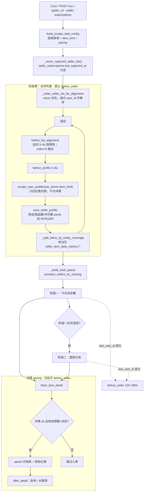

# 卖家订阅采集优先级策略（SSOT）

> **文档地位**：卖家订阅「采谁、先采什么、分几段」的**唯一策略源**。  
> **对应实现**：`src/seller_subscription_scraper.py`、`src/domain/seller_subscription_pacing.py`  
> **对应测试**：`tests/unit/test_seller_subscription_priority_strategy.py`  
> **姊妹文档**：[卖家订阅采集与风控](./seller-subscription-scrape.md)（节奏参数、账号、表结构、API；**不**重复写优先级）  
> **对应 PRD**：[卖家订阅大规模采集 · 风控与运营](../prd/seller-subscription-anti-risk.md)（产品目标；**现行采集顺序以本文为准**）  
> **核对日期**：2026-09-17（与当时代码一致，非规划草案）  
> **归档**：2026-09-20 冻结见 [milestone-2026-09-20.md](./milestone-2026-09-20.md)

---

## 1. 文档地位与变更流程

本文描述的是 **已经上线的现行策略**，不是 backlog。任何采集顺序、阶段划分、店铺/商品排序、覆盖判定的修改，都必须走：

```text
① 先改本文对应章节（写清新旧行为差）
② 再改代码（§7 列出的函数）
③ 再改 / 新增 tests/unit/test_seller_subscription_priority_strategy.py
④ 需要时才改 seller-subscription-scrape.md 的 pacing 默认值或 PRD 验收
```

**禁止**：只改代码不改本文；或在 scrape / PRD / 注释里另写一套与本文冲突的优先级。  
评审采集 PR 时，以本文 + 单测用例名为对照清单。

---

## 2. 目标与非目标

### 2.1 目标（现行）

| ID | 目标 |
|----|------|
| S1 | 一次任务内先对齐 **全部启用订阅卖家** 的在售列表，再点任何商品详情 |
| S2 | **从未成功入库过商品** 的店铺，在列表对齐和详情两阶段都排最前 |
| S3 | 详情按 **全局两阶段**：所有店「今日无日指标」→ 全部完成后才「刷新今日已有」 |
| S4 | 阶段一/二内部按店聚合：同一阶段内先跑完一家的队列，再切下一家（切店才用长冷却） |
| S5 | 对齐列表阶段只用短预热，避免 50+ 店在点详情前就烧掉数十分钟冷却 |

### 2.2 非目标

- 不在本文展开风控秒数、无头模式、多账号分工（见 scrape 方案）
- 不改变关键词搜索任务（`tasks`）的优先级
- 不把闲鱼主页展示的店铺商品总数当成「监控商品数」
- 本期不做：按想要/浏览热度排序、跨店 round-robin 逐条交错、阶段零也点详情

---

## 3. 策略总览

一次运行只走下面这条流水线（入口见 §7.3）。阶段零结束前 **不得** 调用 `fetch_item_detail`。



**硬顺序**：阶段零（全体主页）→ 阶段一（全体 missing）→ 阶段二（全体 covered）。阶段之间不交错。

---

## 4. 阶段细则

### 4.1 阶段零：对齐列表

| 项 | 现行规则 |
|----|----------|
| 卖家集合 | `build_scrape_task_config` → 仅 **enabled** 订阅；空则整次任务跳过 |
| 行为 | 对每店 `scrape_user_profile`，`max_items=item_limit`；只取 `商品状态 == "在售"`，再切片 `[:item_limit]` |
| 不做什么 | **不** `fetch_item_detail`；**不** `before_seller` |
| 从未采过 | `_never_captured_seller_ids()`：读 `list_subscriptions_sync()`，`last_captured_at` 假值（`None` / `""`）且 `seller_user_id` 非空。查库异常 → 空集（全部当「已采过」） |
| 对齐顺序 | `_order_seller_ids_for_alignment`：`(0 if in never_ids else 1, user_id)`。组内 **user_id 升序**（不是订阅表插入序） |
| pacing | 每店：`before_list_alignment(seller_index)` → `before_profile()`。index=0 的 alignment 为空操作；index>0 用 **profile_warmup（默认 3–6s）**。随后 `before_profile` **每店都会再等一次** 3–6s |
| 画像 | `save_seller_profile`：粉丝 / 在售或已售商品数 / 评价总数先 `parse_metric_int` 再写入 INTEGER |
| 无在售 | 打日志后 **不进入** `SellerScrapePlan`，该店本轮无详情 |
| 覆盖拆分 | `_split_items_by_today_coverage`：`list_item_ids_with_daily_snapshot_sync`（`snapshot_day` 默认 **Asia/Shanghai 今天**，表 `seller_item_daily_metrics`）。组内 `prioritize_missing_today` **shuffle** |

`last_captured_at` **不会**在阶段零写入。只有详情阶段该店至少入库 1 条后，`touch_subscription_captured` 才更新。因此「只对齐过主页、从未入库」的店下一轮仍算 never_captured。

### 4.2 阶段一：今日未采集

| 项 | 现行规则 |
|----|----------|
| 判定 | 计划内 `missing_items`：商品 ID **不在** 当日 `seller_item_daily_metrics` |
| 空 ID | `商品ID` 为空视为 missing（无法匹配 covered 集合） |
| 店铺排序 | `SubscriptionPacing.prioritize_sellers_by_missing`：先 `random.shuffle`，再稳定排序键见 §5。因 `user_id` 唯一，shuffle 对最终店序无可见影响 |
| 队列形状 | `_build_work_queue`：按排序后的店，**依次展开该店全部 missing**（店内保持 missing 列表顺序，即 shuffle 后的 missing） |
| 完成条件 | `phase_missing` 全部处理完才打印并进入阶段二；**不允许**穿插任何 covered |
| pacing | 见 §6：详情间隔 / 批休 / 长暂停；**仅当 `last_user_id` 变化** 时 `before_seller(1)`（恒传 1，从而必走卖家长冷却） |

### 4.3 阶段二：更新已有

| 项 | 现行规则 |
|----|----------|
| 判定 | `covered_items`：当日已有日指标，刷新想要 / 浏览 |
| 店铺顺序 | **复用阶段一的店序**（仍按 `never_captured` + `missing_count`，**不是** `covered_count`） |
| 队列形状 | 按该店序展开各店 `covered_items` |
| 入库条件 | 与阶段一相同（§4.4） |
| pacing | 与阶段一相同；阶段一最后一家若与阶段二第一家相同，**不**再切店冷却 |

### 4.4 详情入库（两阶段共用）

必须同时满足：

1. `fetch_item_detail` 未抛错且 `detail["ok"]`
2. `has_want_and_view(item_data)` 为真（想要、浏览都是有效度量，拒绝 `NaN` / `-` / 缺失等）
3. 写入前再 `parse_metric_int` 得到 `_want_count` / `_view_count`（支持 `1.1w`、`1.2万`、`3k` 及大小写 `W`）

然后 `upsert_seller_item_daily_snapshot`（静态主表 + `crawl_raw_records` + 当日指标，同日覆盖）。  
`before_detail`：凡发出详情请求前都走（含随后失败）。  
`after_detail`：**仅入库成功后**走（批休 / 长暂停按传入的全局 `item_index` 取模；与 `batch_size` 重合时 **只批休、不长暂停**）。

---

## 5. 优先级规则表

### 5.1 店铺级

| 优先级 | 键 | 实现 | 用于 |
|--------|----|------|------|
| 1（最高） | `never_captured` | `last_captured_at` 为空 | 阶段零对齐顺序；阶段一/二店序 |
| 2 | `missing_count` 降序 | 该店今日无日指标的在售条数（已受 `item_limit` 截断） | 仅详情店序；**对齐阶段不用此键** |
| 3 | `user_id` 升序 | 字符串比较 | 对齐与详情的并列打散 |

**明确规则**：从未采过、即使今日缺采只有 1 条，也排在「老店缺采 80 条」前面（测试 `test_prioritize_sellers_never_captured_beats_higher_missing_count`）。

### 5.2 商品级（同一店、同一阶段内）

| 组 | 判定 | 组内顺序 |
|----|------|----------|
| missing | 无当日 `seller_item_daily_metrics` 行 | `random.shuffle` |
| covered | 有当日行 | `random.shuffle` |

全局队列 **不是** 跨店按商品交错，而是「店 A 的本组全部 → 店 B 的本组全部」。

### 5.3 `item_limit`

| 项 | 现行 |
|----|------|
| 含义 | **每店最多监控前 N 条在售**（主页列表顺序截断），不是全店商品 |
| 默认 | `DEFAULT_SELLER_SUBSCRIPTION_ITEM_LIMIT = 100`（调度表 `seller_subscription_schedule.item_limit` 默认相同） |
| 解析 | `_resolve_item_limit`：非法则回退 100，再 `max(1, limit)` |
| 作用点 | `scrape_user_profile(..., max_items=item_limit)` **以及** 在售过滤后再次 `[:item_limit]` |

### 5.4 监控列表 ≠ 店铺商品数

| 口径 | 来源 | 含义 |
|------|------|------|
| 商品监控列表 / `GET .../stats` 的 `item_count` | `list_latest_item_metrics` → `DISTINCT ON (item_id)` 已入库日指标 | **已成功入库的去重商品** |
| 画像 `seller_profiles.item_count` | 主页「在售/已售商品数」经 `parse_metric_int` | 闲鱼展示的店铺计数，**不是**监控清单长度 |

详情失败或缺少想要/浏览的商品 **不会** 出现在监控列表。

---

## 6. 与风控节奏的关系

数值默认值、`pacing_json` 覆盖、批休/长暂停公式见 [seller-subscription-scrape.md](./seller-subscription-scrape.md) 与 `DEFAULT_PACING`。本文只规定 **钩子绑定**：

| 时机 | 钩子 | 用哪档 | 不用哪档 |
|------|------|--------|----------|
| 阶段零店间 | `before_list_alignment` | `profile_warmup` 短预热 | **禁止** `seller_cooldown` / `before_seller` |
| 阶段零打开主页 | `before_profile` | 同上短预热（每店一次） | — |
| 阶段一/二切店 | `before_seller(1)` | `seller_cooldown`（默认 120–300s） | 不再 `before_profile`（主页已在阶段零拉完） |
| 每条详情前 | `before_detail` | `detail_delay`（默认 4–8s；整次任务第 1 条 `item_index==0` 不等待） | — |
| 入库成功后 | `after_detail` | 每 10 条批休 60–120s；每 25 条长暂停 90–180s | — |

阶段零即使订阅 50 家，也不得套用切店长冷却。详情阶段在 **同一阶段内换店** 才交长冷却。

---

## 7. 代码与测试索引

### 7.1 策略与节奏

| 职责 | 符号 | 文件 |
|------|------|------|
| 主流程三阶段 | `_scrape_seller_ids` | `src/seller_subscription_scraper.py` |
| 计划结构 | `SellerScrapePlan` | 同上 |
| never 集合 | `_never_captured_seller_ids` | 同上 |
| 对齐排序 | `_order_seller_ids_for_alignment` | 同上 |
| 今日覆盖拆分 | `_split_items_by_today_coverage` | 同上 |
| 全局两阶段队列 | `_build_work_queue` | 同上 |
| 每店上限 | `_resolve_item_limit` | 同上 |
| 店序 / 商品组 shuffle | `prioritize_sellers_by_missing`、`prioritize_missing_today` | `src/domain/seller_subscription_pacing.py` |
| 短预热 vs 长冷却 | `before_list_alignment`、`before_seller`、`before_profile`、`before_detail`、`after_detail` | 同上 |
| 今日已采 ID | `list_item_ids_with_daily_snapshot_sync` | `src/services/seller_item_daily_storage.py` |
| 度量解析 | `parse_metric_int`、`has_want_and_view` | `src/domain/seller_ids.py` |
| 画像 INTEGER | `save_seller_profile_sync` | `src/services/seller_subscription_storage.py` |
| 标记已采 | `touch_subscription_captured` | 同上 |

### 7.2 测试（改策略必跑）

| 文件 | 钉住的行为 |
|------|------------|
| `tests/unit/test_seller_subscription_priority_strategy.py` | 对齐 never 优先；阶段零不用 `before_seller`；全体主页早于任何详情；never 店详情先于缺采更多的老店；全局 missing 全部早于任何 covered |
| `tests/unit/test_seller_subscription_pacing.py` | 钩子等待区间（若改 pacing 绑定需同步） |
| `tests/unit/test_seller_ids_metrics.py` | `1.1w` / `1.2万` / `3k` |
| `tests/unit/test_seller_subscription.py` | `has_want_and_view`；默认 `item_limit==100` |

### 7.3 入口 / 日志 / 配置

| 入口 | 路径 |
|------|------|
| Cron | `SchedulerService.reload_seller_subscription_job` → `ProcessService.start_seller_subscription_job` |
| 手动 | `POST /api/seller-subscriptions/run` |
| CLI / 子进程 | `python spider_v2.py --seller-subscriptions` → `scrape_registered_seller_subscriptions` |

子进程虚拟 `task_id = SELLER_SUBSCRIPTION_JOB_ID = -1`，日志文件：

```text
logs/seller_subscriptions_-1.log
```

（`build_task_log_path(task_id, task_name)` → `{sanitize(task_name)}_{task_id}.log`）

采集控制台内嵌实时日志：`.env` 的 `SELLER_SUBSCRIPTION_CONSOLE_LOG=true`（默认 `false`），见 `is_seller_subscription_console_log_enabled()`。

---

## 8. 以后改策略的检查清单

改之前在 PR / 提交说明里勾选；**先改本文章节号**。

| 若要改… | 先改本文 | 再改代码 | 测试应覆盖 |
|---------|----------|----------|------------|
| 阶段数量或「全体主页先于详情」 | §3、§4.1 | `_scrape_seller_ids` 两大循环 | `test_phase0_scrapes_all_profiles_before_any_item_detail` |
| never 定义（例如改成「无任何日指标」） | §4.1、§5.1 | `_never_captured_seller_ids`、`touch_subscription_captured` 时机 | `test_never_captured_seller_ids_*` |
| 对齐排序 | §4.1、§5.1 | `_order_seller_ids_for_alignment` | `test_alignment_orders_never_captured_sellers_first` |
| 店序（缺采 vs 新店） | §5.1 | `prioritize_sellers_by_missing`、`_build_work_queue` | `test_prioritize_sellers_never_captured_beats_higher_missing_count` |
| 「今日覆盖」日历或表 | §4.2 | `_split_items_by_today_coverage`、`list_item_ids_with_daily_snapshot_sync` | `test_items_without_today_snapshot_before_covered` |
| 全局两阶段 vs 按店跑完 | §2、§4.2–4.3、§9 | `_build_work_queue` + 详情 `for phase_name, work_queue` | `test_build_work_queue_phase1_all_missing_then_phase2_updates`、`test_scrape_phase1_missing_across_shops_before_any_phase2_update` |
| 阶段零是否用长冷却 | §6、§9 | 阶段零循环只准 `before_list_alignment` | `test_phase0_does_not_call_before_seller_long_cooldown`、`test_before_list_alignment_uses_short_warmup_not_seller_cooldown` |
| `item_limit` 默认或截断位置 | §5.3 | `_resolve_item_limit`、`scrape_user_profile`、在售切片 | 调度 / scraper 单测 |
| 入库门槛或 `1.1w` 解析 | §4.4 | `has_want_and_view`、`parse_metric_int`、`save_seller_profile` | `test_seller_ids_metrics.py` |
| 监控列表口径 | §5.4 | items API / `DISTINCT ON (item_id)` | API 单测（若有） |

---

## 9. 已否决 / 未做

写入本文是为了避免「顺手改回」；要推翻须先改 §2/§3 并加反向测试。

| 方案 | 状态 | 原因（与现行代码一致） |
|------|------|------------------------|
| 对齐列表阶段使用 `before_seller`（120–300s） | **否决** | 店数一多，点详情前冷却已耗尽窗口；阶段零已用 `before_list_alignment` |
| 一家店把 missing+covered（例如 100 条更新）全部跑完再进第二家 | **否决** | 新店/缺采店的「今日第一口」会被老店全日刷新堵住；现行是全局阶段一完成才阶段二 |
| 跨店 round-robin 逐条交错 missing | **未做** | 现行阶段内仍按店聚合，便于切店冷却语义清晰 |
| 用画像 `item_count` / 闲鱼店铺商品总数当监控清单 | **否决** | 监控列表 = 入库去重商品 |
| 阶段零写入 `last_captured_at` | **未做** | 无成功商品入库仍视为从未采过 |
| 按想要/浏览/价格排序详情队列 | **未做** | 组内 shuffle，无热度键 |
| 详情失败也 `after_detail` 批休 | **未做** | 现行仅入库成功后批休 |

---

## 10. 实现对照备忘（评审用，非任务清单）

对照 `_scrape_seller_ids` 时建议按时间顺序看日志前缀：

1. `[策略] 阶段零：对齐 N 个订阅卖家的商品列表（仅主页，不做详情；从未采集 X 家优先）`
2. `=== 拉取卖家主页 {id}（监控前 {item_limit} 条在售商品）===`
3. `[策略] 阶段一：今日未采集 …` / `[策略] 阶段二：更新已有 …`
4. `--- 开始阶段：今日未采集|更新已有 ---`
5. `[{阶段}] 卖家 … 商品 …` → `入库` 或 `跳过 … 缺少有效的想要/浏览量`

若日志出现阶段零期间的 `切换卖家，模拟离开上一店铺`（`before_seller` 文案），即为回归，与本文冲突。
