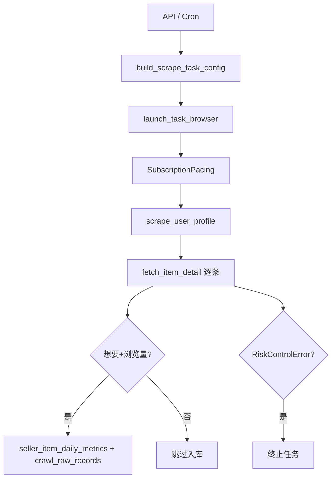

# 技术方案：卖家订阅采集与风控

> **对应 PRD**：[卖家订阅大规模采集 · 风控与运营](../prd/seller-subscription-anti-risk.md)  
> **更新日期**：2026-09-17

---

## 1. 范围

独立卖家订阅表 `seller_subscriptions` + 全局调度 `seller_subscription_schedule`，与 `tasks` 解耦。采集入口：

- Cron → `SchedulerService.reload_seller_subscription_job`
- 手动 → `POST /api/seller-subscriptions/run`
- 子进程 → `seller_subscription_scraper.scrape_registered_seller_subscriptions`

### 1.1 采集优先级（不要写在本文）

卖家/商品的采集**顺序**、三阶段划分（对齐列表 → 今日未采集 → 更新已有）、店铺排序键、以及哪个阶段允许 `before_seller`，以 **[卖家订阅采集优先级策略（SSOT）](./seller-subscription-collection-strategy.md)** 为唯一策略源。

本文只描述风控 pacing 参数、账号、表结构与 API。**禁止**在本文再抄一套阶段规则。修改采集逻辑：先改 SSOT → 再改 `seller_subscription_scraper.py` / `seller_subscription_pacing.py` → 再补测试。

---

## 2. 执行链路

| 阶段 | 模块 | 说明 |
|------|------|------|
| 浏览器 | `scraper.launch_task_browser` | 登录态、`_resolve_headless`、反检测 init_script |
| 节奏 | `domain/seller_subscription_pacing` | 详情间隔、批休、卖家切换冷却、长暂停 |
| 列表 | `scraper.scrape_user_profile` | 卖家主页 MTOP，受 `item_limit` 限制 |
| 详情 | `scraper.fetch_item_detail` | 单商品详情；配合 pacing 前后钩子 |
| 入库 | `seller_item_daily_storage.upsert_seller_item_daily_snapshot` | 同事务写静态主表 + 通用原始表 + 日指标（1:1）；同日覆盖 |

### 2.1 日级数据模型

| 表 | 说明 |
|----|------|
| `seller_subscription_items` | 静态主表（title/price/status/link），慢变 UPSERT |
| `crawl_raw_records` | 通用原始表：`created_at` / `updated_at` / `raw_json`（含 `crawl_record` + `detail_api_raw`） |
| `seller_item_daily_metrics` | 日指标；`raw_record_id` UNIQUE FK → `crawl_raw_records`（严格 1:1） |
| `seller_profiles` | 卖家画像按 `profile_day`（Asia/Shanghai）UPSERT |

历史回填：`python scripts/backfill_seller_item_daily.py`（支持 `--dry-run`）。

---

## 3. 风控信号与处理

| 信号 | 代码 | 行为 |
|------|------|------|
| `div.baxia-dialog-mask` | `scraper.py` | `RiskControlError`，不重试 |
| `FAIL_SYS_USER_VALIDATE` | MTOP 响应 | 随机休眠后 `RiskControlError` |
| 登录跳转 | `LoginRequiredError` | FailureGuard 累计失败 |

**设计原则**：风控错误不触发账号/IP 轮换；靠 **pacing 降频** 与 **FailureGuard**（`TASK_FAILURE_THRESHOLD` / `TASK_FAILURE_PAUSE_SECONDS`）避免死循环重试。

---

## 4. 调度配置（`seller_subscription_schedule`）

| 字段 | 类型 | 说明 |
|------|------|------|
| `cron` | text | APScheduler cron |
| `item_limit` | int | 每卖家最多采集条数 |
| `pacing_json` | jsonb | 覆盖 `SubscriptionPacingConfig` 默认 |
| `run_headless` | boolean | 无头模式；`NULL` 时继承 `RUN_HEADLESS` |
| `account_strategy` / `account_state_file` | | 单任务单账号（见 §5） |

**无头模式优先级**（`scraper._resolve_headless`）：

1. `task_config.run_headless`（来自调度 DB，经 `resolve_schedule_run_headless`）
2. 全局 `.env` `RUN_HEADLESS`

**API**：

- `PATCH /api/seller-subscriptions/schedule` — 含 `run_headless`
- 响应 `run_headless_effective` — 实际运行值

**迁移**：`ensure_incremental_schema` + `supabase/migrations/20260917100000_seller_schedule_run_headless.sql`

---

## 5. 账号与多机分工

`launch_task_browser` 每次任务绑定**一个** `state/*.json`：

| `account_strategy` | 实际行为 |
|--------------------|----------|
| `fixed` | 使用 `account_state_file` |
| `auto` / `rotate` | 当前仅取 `state/` 第一个文件，**不在卖家间轮换** |

多账号扩容：**运营侧**拆卖家子集 + 多实例/多 Cron，而非单次任务内 rotate（backlog：对齐关键词任务 `RotationPool`）。

---

## 6. 登录态

推荐 Chrome 扩展增强快照（`env` / `headers` / `storage`），由 `_is_extension_snapshot` + `_prepare_browser_context_from_snapshot` 注入 Playwright context。见 [Cookie 指南](../getting-xianyu-cookies.md)。

---

## 7. 关键文件索引

| 职责 | 路径 |
|------|------|
| 节奏策略 | `src/domain/seller_subscription_pacing.py` |
| 调度构建 | `src/services/seller_subscription_service.py` |
| 采集主流程 | `src/seller_subscription_scraper.py` |
| 浏览器 | `src/scraper.py` |
| 存储 | `src/services/seller_subscription_storage.py` |
| 调度 UI | `web-ui/src/views/SellerCollectionView.vue` |
| 调度弹窗 | `web-ui/src/components/sellers/SellerScheduleDialog.vue` |
| 熔断 | `src/failure_guard.py` |

---

## 8. Backlog（技术）

- [ ] 调度 UI 编辑 `pacing_json`
- [ ] `launch_task_browser` 支持 `rotate` / 按卖家切号
- [ ] 有头窗口离屏启动（`--window-position`）减少闪屏

---

*产出：software-company 架构师路径；与 PRD 2026-09-17 同步*
