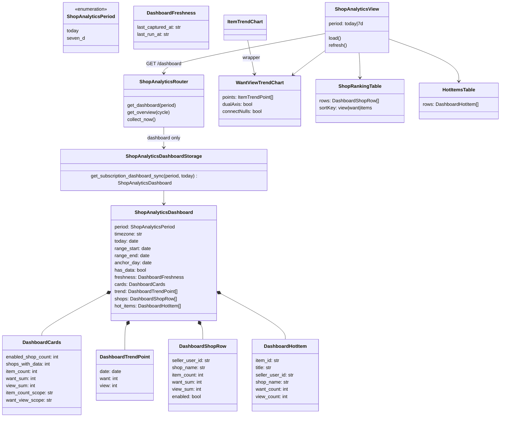
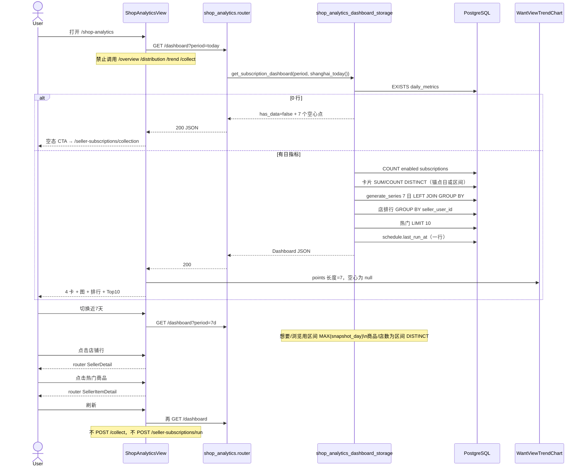
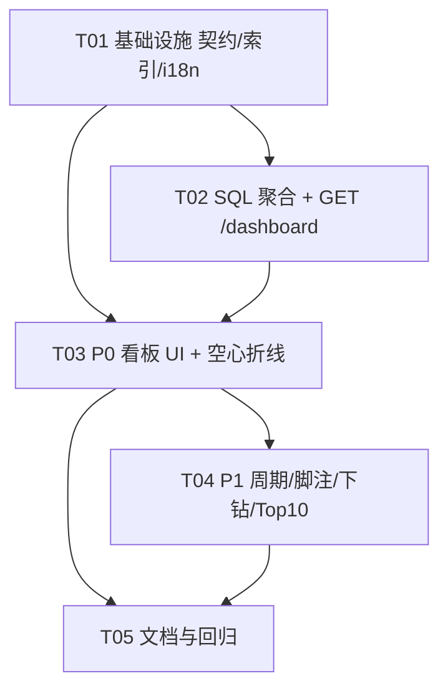

# 店铺分析：卖家订阅日指标看板

> **文档性质**：架构设计（software-company / 架构师 高见远）  
> **日期**：2026-09-17  
> **对应 PRD**：[店铺数据页改为卖家订阅分析看板](../prd/shop-analytics-subscription-dashboard.md)  
> **口径 SSOT**：[`seller-subscription-collection-strategy.md`](./seller-subscription-collection-strategy.md) §5.4（监控商品 ≠ 店铺商品总数）

---

## Part A：系统设计

### 1. Implementation Approach

#### 1.1 问题与约束

`/shop-analytics` 当前读 `shop_datacompass_snapshots`。库里罗盘快照 **0 行**，主状态被「请先创建并运行店铺数据罗盘采集任务」挡住。真实数据在 `seller_item_daily_metrics`（当前约 187 行 / 2 店 / 两天），页面却是 6 张硬编码罗盘卡 + `<ul>` 分布 + 文字 `showPv`。

产品已锁定：

- 主数据源：`seller_item_daily_metrics` + `seller_subscriptions` + `seller_profiles`
- 主页不再以罗盘空消息为主状态；「立即采集」不再触发 `shop_datacompass`
- 本页不触发订阅采集（Q3）
- 趋势图始终 7 个上海日历日；无数据日 **null，不得补 0**（Q2）
- 「近 7 天」卡片想要/浏览 = 区间内**最新有数据日**合计，不跨日求和（Q1）
- 技术栈保持 **FastAPI + Vue 3 + shadcn-vue + Tailwind**，不引入 React / ECharts

#### 1.2 关键技术点

| 难点 | 做法 |
|------|------|
| 聚合必须在 SQL | 禁止走现有 `GET /api/seller-subscriptions/stats`（它 `list_latest_item_metrics(..., limit=10000)` 再 `len()`）。看板用 `COUNT(DISTINCT)` / `SUM` / `GROUP BY snapshot_day`。 |
| 空心日 | 7 日轴用 `generate_series` LEFT JOIN 日合计；缺日 `want`/`view` 为 SQL `NULL` → JSON `null`。Python 只序列化 ≤7 行，不把度量补 0。 |
| 上海日历 | 一律 `shanghai_today()`（`src/time_utils.py` / `seller_item_daily_storage` 已导出）。区间 `[today-6, today]`。 |
| 现有折线图会吞空心日 | `ItemTrendChart.vue` 用 `validPoints = points.filter(非 null)` 再算 X，7 格会塌成 2 个实心点。必须抽离共享图：X 轴用**全量 points**，null **断线**、不画圆点、刻度仍在。 |
| 想要 vs 浏览量级差 | 看板图默认 **双 Y 轴**（左想要、右浏览）。商品详情图保持单轴，避免改观感。 |
| 旧测试 / 首页罗盘条 | **不改造** `GET /overview`。新增 `GET /api/shop-analytics/dashboard`。首页 `DashboardView` 仍走 `dashboard_service` → datacompass，本期不动。 |

#### 1.3 兼容策略（选新接口，不改 overview）

**选定**：`GET /api/shop-analytics/dashboard?period=today|7d`（默认 `today`）。

| 路径 | 本期行为 | 调用方 |
|------|----------|--------|
| `GET /api/shop-analytics/dashboard` | **主看板唯一数据源**（只读） | 仅 `ShopAnalyticsView` |
| `GET /overview` `/flow` `/distribution` `/trend` | **原样保留**（空快照仍 `has_data:false` + 罗盘 `empty_message`） | 旧单测/集成测、`dashboard_service` 间接不走这些前端函数 |
| `POST /collect` | **保留**，本页 **禁止调用** | 无 UI 入口；避免破坏可能的外部脚本 |

不把 dashboard 语义塞进 `/overview` 的原因：现测例断言 `empty_message` 含「店铺数据快照」；首页仍按 datacompass 字段展示。混用会破坏 Q6「主页面不再调用旧 overview」。

#### 1.4 分层

```
ShopAnalyticsView
  → getShopAnalyticsDashboard()          # web-ui/src/api/shopAnalytics.ts
    → GET /api/shop-analytics/dashboard  # src/api/routes/shop_analytics.py
      → get_subscription_dashboard()     # src/services/shop_analytics_dashboard_storage.py
        → PostgreSQL（同一 connection 多条聚合 SQL）
```

- **不**把跨店聚合写进 `seller_item_daily_storage.py`（该模块是写入 + 单商品/列表）。
- **不**扩展 `/stats`。
- 路由仍挂 `shop_analytics.router` 前缀 `/api/shop-analytics`，避免再注册一套订阅域路径。

#### 1.5 口径（实现与 UI tooltip 必须一致）

与 SSOT §5.4、PRD §4.1 一致：

| 字段 | SQL 语义 | 禁止 |
|------|----------|------|
| `cards.enabled_shop_count` | `seller_subscriptions` 中 `enabled IS TRUE` 的行数 | 不含停用店 |
| `cards.shops_with_data` | 锚点日（或 7 日区间）`COUNT(DISTINCT seller_user_id)` | — |
| `cards.item_count` | 今天：该日 `COUNT(DISTINCT item_id)`；近 7 天：区间去重 | **不是** `seller_profiles.item_count`，不是全库跨日 185 |
| `cards.want_sum` / `view_sum` | **锚点日** `SUM(want_count)` / `SUM(view_count)` | 不是曝光/UV/`showPv`；近 7 天不跨日相加 |
| 店名 | `COALESCE(profile.nickname, subscription.nickname, seller_user_id)` | — |
| 空状态 | 表内 `task_name='seller_subscriptions'` **0 行** | 有订阅无日指标也空；引导采集控制台，不提罗盘 |

`task_name` 过滤常量：`SELLER_SUBSCRIPTION_TASK_NAME`（`"seller_subscriptions"`）。

**锚点日 `anchor_day`**：

- `period=today`：`shanghai_today()`（即使当天 0 行，锚点仍是今天；卡片为 0，排行/热门为空）。
- `period=7d`：区间内 `MAX(snapshot_day)`；区间全空则 `anchor_day=null`，想要/浏览为 `null`（不是 0）。

**空状态 vs 今日尚未入库**：全表 0 行 → `has_data=false`，整页空态。全表有行但今天 0 行 → `has_data=true`，卡片为 0，趋势图仍画近 7 日（可有历史实心点）。可选脚注：「今天尚未入库」。

停用店：不计入订阅店数；若锚点日仍有日指标，**出现在排行**，`enabled=false`，UI 脚注「已停用」（P1/Q4）。

#### 1.6 索引

现有 `idx_seller_item_daily_metrics_task_day (task_name, snapshot_day DESC)` 已能支撑按日过滤。店数上涨后排行 `GROUP BY seller_user_id` 需要更贴查询的序：

```sql
CREATE INDEX IF NOT EXISTS idx_seller_item_daily_metrics_task_day_seller
  ON seller_item_daily_metrics (task_name, snapshot_day, seller_user_id);
```

写入 `db_connection.py` 的 `_INCREMENTAL_SCHEMA_STATEMENTS`（`CREATE INDEX IF NOT EXISTS`），不另开 Alembic。

#### 1.7 UI 结构（沿用 Card / app-surface）

不做 6 张罗盘卡、不做来源/品类/时段/地域下拉、不做 `date · showPv` 列表。

1. 标题「店铺分析」+ 口径副文案 + 新鲜度  
2. `[今天 | 近7天]` + `[刷新]`（刷新 = 再 GET dashboard；无采集按钮）  
3. 4 张卡片  
4. 想要/浏览趋势（共享 `WantViewTrendChart`）  
5. 店铺排行（默认浏览降序；P1 表头切换排序在**前端**对已返回数组排序）  
6. 热门商品 Top 10（P1）  
7. 空态：主按钮 `/seller-subscriptions/collection`，次链 `/seller-subscriptions/sellers`

下钻：店行 → `{ name: 'SellerDetail', params: { sellerUserId } }`；商品行 → `{ name: 'SellerItemDetail', params: { itemId } }`。

#### 1.8 聚合 SQL（工程师按此实现，禁止先拉明细再 sum）

同一 `with db_connection() as conn:` 内执行。示意（占位符 `?`，与现网 dialect 一致）。

**A. 是否有数**

```sql
SELECT 1
FROM seller_item_daily_metrics
WHERE task_name = ?
LIMIT 1
```

**B. 启用订阅店数**

```sql
SELECT COUNT(*) AS enabled_shop_count
FROM seller_subscriptions
WHERE enabled IS TRUE
```

**C. 7 日锚点（仅 period=7d）**

```sql
SELECT MAX(snapshot_day) AS anchor_day
FROM seller_item_daily_metrics
WHERE task_name = ?
  AND snapshot_day BETWEEN ? AND ?
```

**D. 卡片（指定 snapshot_day；无行则 Python 填 0）**

```sql
SELECT
  COUNT(DISTINCT item_id) AS item_count,
  COUNT(DISTINCT seller_user_id) AS shops_with_data,
  COALESCE(SUM(want_count), 0) AS want_sum,
  COALESCE(SUM(view_count), 0) AS view_sum,
  MAX(captured_at) AS last_captured_at
FROM seller_item_daily_metrics
WHERE task_name = ?
  AND snapshot_day = ?
```

**E. 近 7 天店/商品去重（仅 period=7d 的卡片店数/商品数）**

```sql
SELECT
  COUNT(DISTINCT item_id) AS item_count,
  COUNT(DISTINCT seller_user_id) AS shops_with_data
FROM seller_item_daily_metrics
WHERE task_name = ?
  AND snapshot_day BETWEEN ? AND ?
```

**F. 趋势（始终 7 格；缺日度量为 NULL）**

```sql
WITH days AS (
  SELECT generate_series(?::date, ?::date, interval '1 day')::date AS snapshot_day
),
agg AS (
  SELECT
    snapshot_day,
    SUM(want_count) AS want_sum,
    SUM(view_count) AS view_sum
  FROM seller_item_daily_metrics
  WHERE task_name = ?
    AND snapshot_day BETWEEN ? AND ?
  GROUP BY snapshot_day
)
SELECT
  d.snapshot_day,
  a.want_sum,
  a.view_sum
FROM days d
LEFT JOIN agg a ON a.snapshot_day = d.snapshot_day
ORDER BY d.snapshot_day
```

**禁止** `COALESCE(a.want_sum, 0)`。无匹配日必须是 `null`。

**G. 店铺排行（锚点日，先聚合再补店名）**

```sql
WITH shop_agg AS (
  SELECT
    seller_user_id,
    COUNT(DISTINCT item_id) AS item_count,
    COALESCE(SUM(want_count), 0) AS want_sum,
    COALESCE(SUM(view_count), 0) AS view_sum
  FROM seller_item_daily_metrics
  WHERE task_name = ?
    AND snapshot_day = ?
  GROUP BY seller_user_id
)
SELECT
  a.seller_user_id,
  a.item_count,
  a.want_sum,
  a.view_sum,
  COALESCE(p.nickname, s.nickname, a.seller_user_id) AS shop_name,
  COALESCE(s.enabled, FALSE) AS enabled
FROM shop_agg a
LEFT JOIN seller_subscriptions s ON s.seller_user_id = a.seller_user_id
LEFT JOIN LATERAL (
  SELECT nickname
  FROM seller_profiles
  WHERE task_name = ?
    AND seller_user_id = a.seller_user_id
  ORDER BY captured_at DESC
  LIMIT 1
) p ON TRUE
ORDER BY a.view_sum DESC NULLS LAST
```

排行行数 = 当天有指标的店数（几十～几百），**不是**商品明细。P1 排序在前端做。

**H. 热门 Top 10（锚点日，浏览降序）**

```sql
SELECT
  m.item_id,
  m.seller_user_id,
  m.want_count,
  m.view_count,
  i.title,
  COALESCE(p.nickname, s.nickname, m.seller_user_id) AS shop_name
FROM seller_item_daily_metrics m
LEFT JOIN seller_subscription_items i
  ON i.task_name = m.task_name
 AND i.seller_user_id = m.seller_user_id
 AND i.item_id = m.item_id
LEFT JOIN seller_subscriptions s ON s.seller_user_id = m.seller_user_id
LEFT JOIN LATERAL (
  SELECT nickname
  FROM seller_profiles
  WHERE task_name = ?
    AND seller_user_id = m.seller_user_id
  ORDER BY captured_at DESC
  LIMIT 1
) p ON TRUE
WHERE m.task_name = ?
  AND m.snapshot_day = ?
ORDER BY m.view_count DESC NULLS LAST
LIMIT 10
```

**I. 新鲜度**：`MAX(captured_at)` 来自 D；`last_run_at` 来自 `seller_subscription_schedule`（现有 `get_schedule_sync`，一行）。展示优先日指标 `captured_at`。

---

### 2. File List

**新建**

| 路径 | 职责 |
|------|------|
| `docs/design/shop-analytics-subscription-dashboard.md` | 本文 |
| `src/domain/shop_analytics_dashboard.py` | `period` 字面量、响应 TypedDict / 校验 |
| `src/services/shop_analytics_dashboard_storage.py` | 只读聚合；`get_subscription_dashboard_sync` + async 包装 |
| `web-ui/src/components/charts/WantViewTrendChart.vue` | 想要/浏览折线；全量 X 轴；null 断线；可选双轴 |
| `web-ui/src/components/shop-analytics/ShopRankingTable.vue` | 店铺排行 + 前端排序 + 下钻 |
| `web-ui/src/components/shop-analytics/HotItemsTable.vue` | 热门 Top 10 下钻 |
| `tests/unit/test_shop_analytics_dashboard.py` | 口径 / 空心日 / SQL 形态 |

**修改**

| 路径 | 变更 |
|------|------|
| `src/api/routes/shop_analytics.py` | 新增 `GET /dashboard`；旧路由不动 |
| `src/infrastructure/persistence/db_connection.py` | 增量索引 |
| `web-ui/src/api/shopAnalytics.ts` | 新增 dashboard 类型与 `getShopAnalyticsDashboard`；旧函数保留但主页面停用 |
| `web-ui/src/views/ShopAnalyticsView.vue` | 整页重做 |
| `web-ui/src/components/sellers/ItemTrendChart.vue` | 改为包装 `WantViewTrendChart`（单轴、dense 点列） |
| `web-ui/src/i18n/messages/zh-CN-extra.ts` | `shopAnalytics.*` 去罗盘语义；**保留** `showPv` 等键给首页 |
| `web-ui/src/i18n/messages/en-US-extra.ts` | 同步；页内 title：Shop Analytics（去 Compass） |
| `tests/unit/test_shop_analytics_api.py` | **保留** overview 空测；新增 dashboard 测 |
| `tests/integration/test_api_shop_analytics.py` | 同上 |
| `docs/features.md` §2.11 / §3.13 | 主能力改为订阅看板 |
| `docs/user-guide.md` | 「店铺数据」操作改为订阅采集数据；罗盘降为可选附录 |
| `docs/design/architecture.md` | 路由表 + 链路 4.2c |
| `docs/design/README.md` | 登记本文 |
| `web-ui/README.md` | `/shop-analytics` 说明 |
| `tests/README.md` | 测例索引 |
| `log.md` | 实现完成后记一笔 |

**明确不改（除非回归）**

- `src/services/shop_datacompass_storage.py`、采集 scraper
- `src/api/routes/seller_subscriptions.py` 的 `/stats`
- `web-ui/src/views/DashboardView.vue` datacompass 四卡（无快照时本就不显示）
- 侧栏文案 `sidebar.shopAnalytics` / `routes.shopAnalytics === '店铺数据'`（P0-9）
- 路由 path `/shop-analytics`

不新增 pip / npm 包。

---

### 3. Data Structures and Interfaces



`item_count_scope`：`anchor_day` | `range`  
`want_view_scope`：`anchor_day` | `latest_day_in_range`

**HTTP 契约**

```
GET /api/shop-analytics/dashboard?period=today|7d
```

- 非法 `period` → **422**
- 始终 **200 + JSON**（与现网 shop-analytics 风格一致，空数据不 404）
- `has_data=false` 时 `cards` 为零值、`trend` 仍返回 7 个 `null` 点（便于前端固定轴），`shops=[]`，`hot_items=[]`。前端以 `has_data` 决定空态，**忽略**旧 `empty_message`。

时间字段经 `to_shanghai_iso`，带 `+08:00`。前端用现有 `formatShanghaiTime`。

`trend` 必须 **恰好 7 项**，按日升序。无匹配日 `want`/`view` 为 `null`。

---

### 4. Program Call Flow



旧 datacompass 链路（`POST /collect` → `shop_datacompass`）**不再出现在本页序列中**；端点留空实现。

---

### 5. Anything UNCLEAR

产品 Q1–Q7 均按 PRD 默认锁定，不阻塞开工。

| # | 项 | 架构决定 |
|---|----|----------|
| Q1 | 近 7 天卡片是否跨日求和 | **否**。`want_view_scope=latest_day_in_range`，UI 标明 `anchor_day`。 |
| Q2 | 今天模式是否仍 7 日轴 | **是**。`trend` 与 `period` 无关。 |
| Q3 | 本页立即采集订阅 | **否**。只链采集控制台。 |
| Q4 | 订阅店数含停用？ | **只计 enabled**。停用店可进排行，`enabled=false`。 |
| Q5 | 店名缺失 | profile → subscription → `seller_user_id`。 |
| Q6 | 旧 API | **留空实现、主页面不调用**；不删除，以保住旧测与首页。 |
| Q7 | 英文页内标题 | `Shop Analytics`，去掉 Compass/datacompass。 |
| A1 | 双 Y 轴 | 看板默认 `dualAxis=true`；商品详情包装单轴。 |
| A2 | 排行排序 | 默认 SQL `view_sum DESC`；P1 表头在前端排序，不再打 API。 |
| A3 | `generate_series` | 仅 PostgreSQL；本项目主库已是 PG。 |
| A4 | 首页 datacompass 四卡 | **本期不动**。无快照时 `v-if` 本就不渲染。 |
| A5 | i18n `showPv` 等旧键 | **保留**给 `DashboardView`；本页不得再绑定这些 key。 |

无未决产品问题。若 QA 用「当前库」验收：今日商品 **~181**（不得标 185 为今日）、想要 **~8344**、浏览 **~65071**、笑笑书馆浏览 ≫ 妮吧啦啦。

---

## Part B：任务分解

### 6. Required Packages

无新依赖。禁止引入 ECharts / Chart.js / React。

### 7. Task List

#### T01 — 看板基础设施（契约、索引、i18n、客户端）

- **优先级**：P0  
- **依赖**：无  

**文件**：`db_connection.py`、`src/domain/shop_analytics_dashboard.py`、`shop_analytics.py` 骨架、`shopAnalytics.ts`、中英文 extra i18n。

#### T02 — SQL 聚合与 dashboard 只读 API

- **优先级**：P0  
- **依赖**：T01  

**文件**：`shop_analytics_dashboard_storage.py`、路由接线、`tests/unit/test_shop_analytics_dashboard.py`、保留并扩展现有 shop-analytics 测。

#### T03 — 主页面看板 + 空心趋势图（P0 UI）

- **优先级**：P0  
- **依赖**：T01、T02  

**文件**：`WantViewTrendChart.vue`、`ItemTrendChart.vue` 包装、`ShopAnalyticsView.vue`、`ShopRankingTable.vue`。

#### T04 — P1：周期切换、店数脚注、下钻、热门 Top10

- **优先级**：P1（本期做完）  
- **依赖**：T03  

**文件**：`HotItemsTable.vue`、View 周期与脚注、排行表排序与下钻。

#### T05 — 文档、changelog、回归入口

- **优先级**：P0-10  
- **依赖**：T03、T04  

**文件**：`docs/features.md`、`docs/user-guide.md`、`docs/design/architecture.md`、`docs/design/README.md`、`web-ui/README.md`、`tests/README.md`、`log.md`。

### 8. Shared Knowledge

1. 时区：业务日 = Asia/Shanghai；`shanghai_today()`；ISO 带 `+08:00`。
2. 空心 = JSON `null`，前端不得 `?? 0` 画趋势。
3. 监控商品 ≠ 画像 `item_count` ≠ 全库跨日 DISTINCT。今日验收数是 **181** 量级，不是 185。
4. 一个只读聚合 API；页面不得并行打 overview/distribution/trend/stats。
5. 本页只读：禁止 `POST /collect`、禁止 `POST /seller-subscriptions/run`。
6. `task_name` 恒为 `seller_subscriptions`。
7. 图表按全量日期索引 X；`ItemTrendChart` 不得再 filter 掉 null 再均分宽度。
8. 侧栏「店铺数据」不动；页内去罗盘；`showPv/ipv/...` 留给首页。
9. 下钻：`SellerDetail`、`SellerItemDetail`；采集控制台 `/seller-subscriptions/collection`。
10. P2：datacompass 不进主看板。

### 9. Task Dependency Graph



建议顺序：T01 → T02 → T03 → T04 → T05。

---

## 附录：工程师自检清单（当前库）

打开 `http://localhost:5173/shop-analytics`：

1. 主区域不是罗盘空状态。
2. 订阅店 2、今日已采商品 ~181、想要 ~8344、浏览 ~65071。
3. 排行至少两行，笑笑书馆浏览明显高于妮吧啦啦。
4. 趋势为图，不是 `showPv` 文本；近 7 天可见空心日。
5. 无日指标环境：主 CTA → 采集控制台。
6. 无曝光/支付/uctr 卡片。
7. Network 面板主路径只有 `GET /api/shop-analytics/dashboard`。
