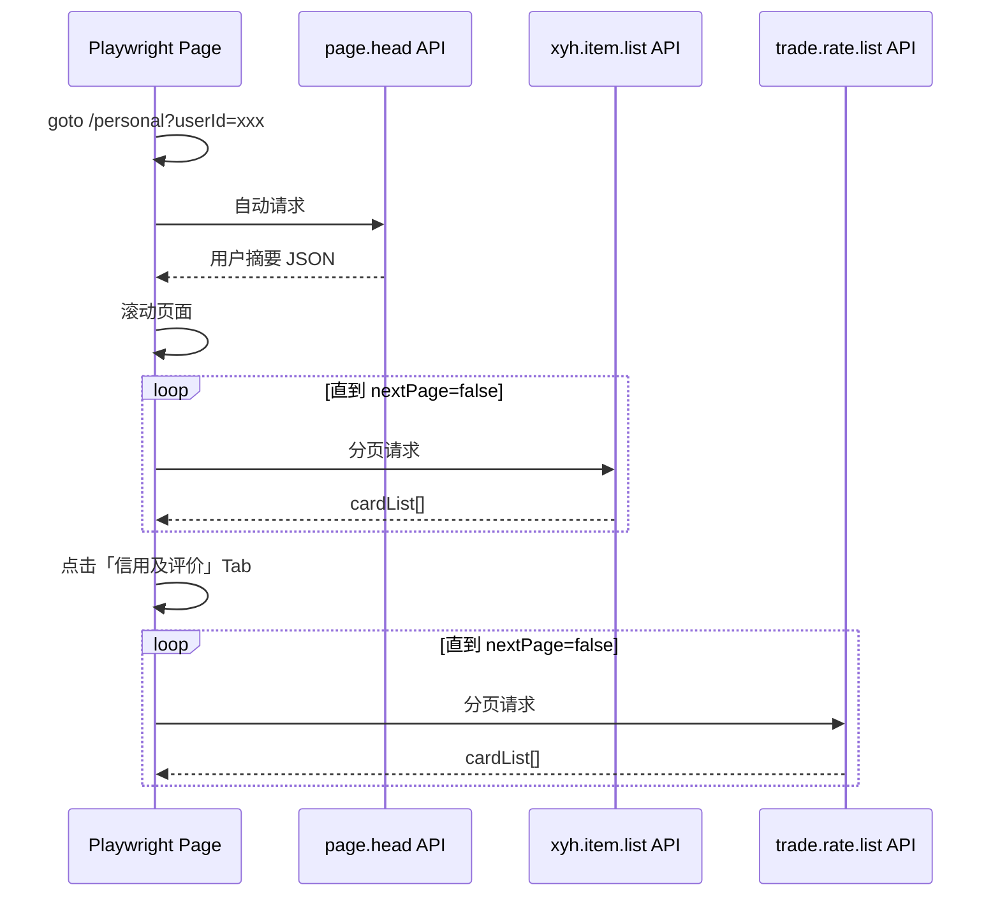

# 闲鱼用户主页探索文档

> 探索目标：[用户主页](https://www.goofish.com/personal?spm=a21ybx.item.itemHeader.1.6e9e3da6wDtisc&userId=2221197154547)  
> 探索时间：2026-09-15  
> 探索方式：Playwright + 网络响应拦截（脚本：`scripts/explore_goofish_pages.py`）  
> 原始快照：`docs/exploration/snapshots/exploration_snapshot.json`、`personal_profile.png`

---

## 1. 页面概览

| 项 | 值 |
|---|---|
| URL 模板 | `https://www.goofish.com/personal?userId={userId}` |
| 示例 userId | `2221197154547` |
| 页面标题 | `咖咖喱酱_闲鱼` |
| 渲染方式 | SPA，核心数据来自 MTOP JSON API，而非 SSR HTML |
| 登录要求 | 匿名可访问基础信息；完整商品/评价滚动加载建议携带 `.goofish.com` Cookie |
| 项目内已有实现 | `src/scraper.py::scrape_user_profile()` |

### 1.1 页面结构（UI）

```
┌─────────────────────────────────────────────────────────────┐
│ 顶部导航：Logo | 当前登录用户 | 订单 | 发闲置 | 消息 | 反馈   │
├─────────────────────────────────────────────────────────────┤
│ 用户头图区                                                   │
│  - 头像 / 昵称「咖咖喱酱」                                    │
│  - 标签：鱼小铺 L3、满意度超级好                              │
│  - 地区：广东省                                              │
│  - 粉丝 7 / 关注 0 / [关注] 按钮                             │
├─────────────────────────────────────────────────────────────┤
│ Tab 1: 宝贝 (22)          Tab 2: 信用及评价 (13)             │
├─────────────────────────────────────────────────────────────┤
│ [宝贝 Tab] 商品卡片网格（瀑布流/列表，滚动分页）              │
│ [评价 Tab] 子筛选：全部 | 有图 | 好评 | 来自买家             │
│            评价卡片：头像、匿名用户、买家标签、好评、内容、时间 │
└─────────────────────────────────────────────────────────────┘
│ 右侧浮层：发闲置 / 消息 / 闲鱼号 / APP / 反馈 / 客服 / 回顶部 │
└─────────────────────────────────────────────────────────────┘
```

### 1.2 关键 DOM 交互点

| 元素 | 选择器/定位 | 作用 |
|---|---|---|
| 评价 Tab | `//div[text()='信用及评价']/ancestor::li` | 切换到评价列表，触发 `mtop.idle.web.trade.rate.list` |
| 商品列表 | 默认 Tab「宝贝」 | 滚动到底触发 `mtop.idle.web.xyh.item.list` 分页 |
| 关注按钮 | 文本「关注」 | 需登录态，非采集必需 |

---

## 2. 核心 API 清单

所有业务 API 均走 `https://h5api.m.goofish.com/h5/{apiName}/1.0/`，需 `_m_h5_tk` 签名 Cookie。

| API | 触发时机 | 用途 |
|---|---|---|
| `mtop.idle.web.user.page.head` | 进入页面 | 用户头部摘要：昵称、头像、信用、粉丝、Tab 计数 |
| `mtop.idle.web.user.page.nav` | 进入页面 | 导航/侧边栏信息 |
| `mtop.idle.web.xyh.item.list` | 默认 Tab + 滚动 | 用户发布的商品列表（分页） |
| `mtop.idle.web.trade.rate.list` | 点击「信用及评价」+ 滚动 | 收到的评价列表（分页） |
| `mtop.taobao.idlemessage.pc.loginuser.get` | 全局 | 当前登录用户 ID |
| `mtop.gaia.nodejs.gaia.idle.data.gw.v2.index.get` | 全局 | 首页/Feed 配置（非主页核心） |

---

## 3. API 字段说明

### 3.1 `mtop.idle.web.user.page.head`

**解析函数**：`src/parsers.py::parse_user_head_data()`

| 路径 | 示例值 | 说明 |
|---|---|---|
| `data.baseInfo.kcUserId` | `2221197154547` | 明文用户 ID |
| `data.baseInfo.encryptedUserId` | `u5BfBbHn20RUqBVuD09dIA==` | 加密 ID |
| `data.baseInfo.self` | `false` | 是否本人主页 |
| `data.module.base.displayName` | `咖咖喱酱` | 昵称 |
| `data.module.base.avatar.avatar` | CDN URL | 头像 |
| `data.module.base.introduction` | `""` | 个性签名 |
| `data.module.base.ylzTags[]` | role=seller/buyer | 信用等级标签（如「极好」「优秀」） |
| `data.module.tabs.item.number` | `22` | 宝贝数量 |
| `data.module.tabs.rate.number` | `13` | 评价数量 |
| `data.module.shop.level` | `L3` | 鱼小铺等级 |
| `data.module.shop.score` | `130` | 店铺积分 |
| `data.module.shop.praiseRatio` | `100` | 好评率（%） |
| `data.module.shop.reviewNum` | `13` | 评价数 |
| `data.module.social.followers` | `7` | 粉丝数 |
| `data.module.social.following` | `0` | 关注数 |
| `data.module.social.followStatus` | `1` | 关注状态 |

**项目映射输出**：

```json
{
  "卖家昵称": "咖咖喱酱",
  "卖家头像链接": "https://...",
  "卖家个性签名": "",
  "卖家在售/已售商品数": 22,
  "卖家收到的评价总数": 13,
  "卖家信用等级": "极好",
  "买家信用等级": "优秀"
}
```

### 3.2 `mtop.idle.web.xyh.item.list`

**解析函数**：`src/parsers.py::_parse_user_items_data()`

| 路径 | 说明 |
|---|---|
| `data.cardList[].cardData.id` | 商品 ID |
| `data.cardList[].cardData.title` | 标题 |
| `data.cardList[].cardData.priceInfo.price` | 价格 |
| `data.cardList[].cardData.priceInfo.preText` | 货币符号（¥） |
| `data.cardList[].cardData.picInfo.picUrl` | 主图 |
| `data.cardList[].cardData.itemStatus` | `0`=在售，`1`=已售 |
| `data.nextPage` | 是否还有下一页 |
| `data.nextPageNum` | 下一页页码 |
| `data.itemGroupList[]` | 商品分组（如「综合」） |

**示例商品**：

| 商品 ID | 标题 | 价格 | 状态 |
|---|---|---|---|
| `1024653673701` | JOYROOM机乐堂30W氮化镓充电头... | ¥19.90 | 在售 |
| `1084908496081` | 机乐堂30W氮化镓快充套盒... | ¥26 | 在售 |

### 3.3 `mtop.idle.web.trade.rate.list`

**解析函数**：`src/parsers.py::parse_ratings_data()`、`calculate_reputation_from_ratings()`

| 路径 | 说明 |
|---|---|
| `data.totalCount` | 评价总数（13） |
| `data.rateTabDOList[]` | Tab 统计：全部/有图/好评/来自买家 |
| `data.cardList[].cardData.feedback` | 评价内容 |
| `data.cardList[].cardData.rate` | `1` 好评 / `0` 中评 / `-1` 差评 |
| `data.cardList[].cardData.rateTagList[0].text` | 角色：`卖家` 或 `买家` |
| `data.cardList[].cardData.raterUserNick` | 评价者昵称（常匿名） |
| `data.cardList[].cardData.gmtCreate` | 评价时间 |
| `data.cardList[].cardData.pictCdnUrlList` | 评价图片 |
| `data.nextPage` | 分页标志 |

**本次样本评价摘要**：13 条均为「来自买家」的「好评」，内容如「好用」「描述真实」「物超所值」等。

---

## 4. 采集流程（与项目实现对齐）



对应代码：`src/scraper.py` 第 353–454 行。

---

## 5. 爬虫实现建议

1. **优先拦截 API，少解析 DOM**：页面为 React/Vue 类 SPA，DOM class 不稳定，MTOP 响应结构稳定。
2. **必须携带 Cookie**：至少 `cookie2`、`_m_h5_tk`、`_m_h5_tk_enc`、`unb`、`sgcookie`。
3. **滚动分页**：商品与评价均靠 `window.scrollTo(0, document.body.scrollHeight)` 触发下一页。
4. **缓存策略**：项目已用 `SellerProfileCache`（默认 TTL 1800s）避免重复采集同一卖家。
5. **风控**：若跳转 `passport.goofish.com` 或 `mini_login`，需更新登录态（见 `docs/getting-xianyu-cookies.md`）。

---

## 6. 探索结论

- 该页面是**卖家画像采集**的核心入口，本项目已在商品分析链路中自动调用。
- 可稳定提取：昵称、信用、L3 等级、在售商品列表、历史评价与好评率。
- 不可直接获取：实时在线状态、私信记录、完整粉丝列表（需其他 API）。
- 504 超时：无 Cookie 或网络异常时网关可能返回 504，需重试并确保登录态有效。

---

## 7. 复现命令

```bash
# 准备登录态（Chrome 扩展导出到 docs/exploration/temp_login_state.json）
python scripts/explore_goofish_pages.py

# 或使用项目内置采集（在爬虫任务中自动触发）
python spider_v2.py --task-name "你的任务名" --debug-limit 1
```
