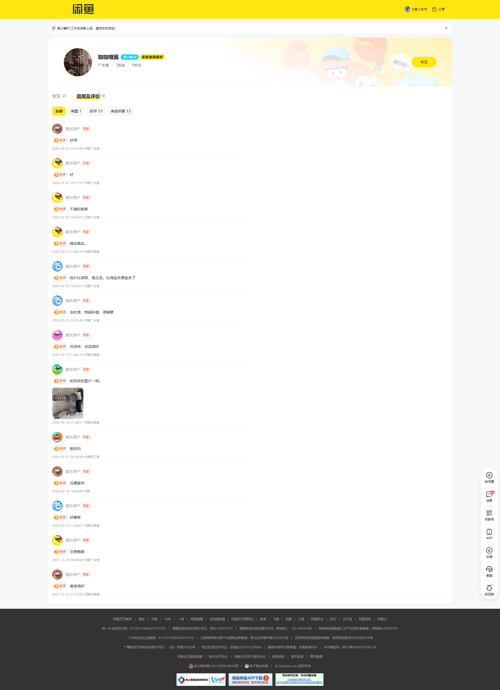
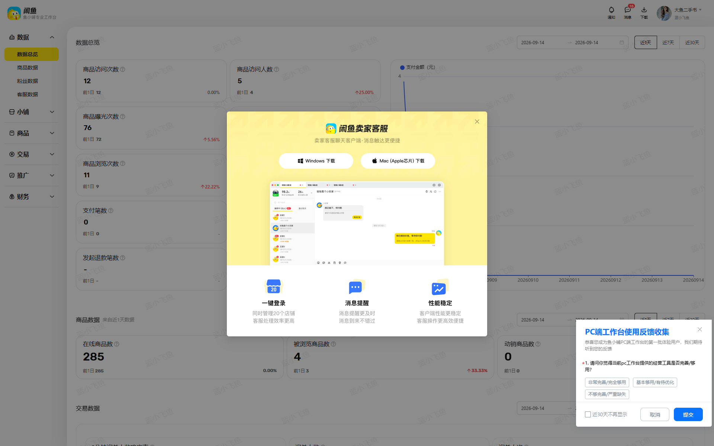

# 用户使用指南

本文档说明如何从安装到日常使用闲鱼智能监控系统。

---

## 一、项目能做什么

- 按关键词、价格、区域等条件 **自动搜索闲鱼商品**
- 用 **AI 图文分析** 或 **关键词规则** 判断是否值得购买
- 通过 ntfy / 企业微信 / Bark / Telegram 等 **推送通知**
- 在 **Web 界面** 管理任务、账号、结果和日志
- 支持 **Cron 定时** 周期性执行
- **卖家订阅**：按用户主页批量采集，追踪想要数/浏览量变化
- **店铺分析**：基于订阅日指标看跨店想要/浏览、排行与近 7 日趋势

---

## 二、快速开始

### 1. 安装与启动

```bash
git clone <仓库地址>
cd ai-goofish-monitor

cp .env.example .env
# 编辑 .env，配置 AI（见 docs/ai-provider.md）

chmod +x start.sh
./start.sh
```

Windows（在 cmd 或资源管理器里运行 `start.bat`）：

```bat
start.bat        :: 正式模式：装依赖 -> 构建前端 -> 启动后端
start.bat dev    :: 开发模式：后端 + 前端热更新
```

Docker 部署：

```bash
cp .env.example .env
docker compose up -d
```

访问：**http://localhost:8000**  
默认账号：`admin` / `admin123`

### 2. 配置 AI

至少配置一种 AI 提供方，详见 [AI 提供方配置](./ai-provider.md)。

### 3. 导入闲鱼登录态

爬虫必须持有有效闲鱼 Cookie，详见 [闲鱼 Cookie 获取指南](./getting-xianyu-cookies.md)。

简要步骤：

1. Chrome 登录 [goofish.com](https://www.goofish.com)
2. 用 Chrome 扩展导出 JSON（推荐）或按 F12 手动复制 Cookie
3. Web UI → **闲鱼账号管理** → 粘贴保存

### 4. 创建并启动任务

Web UI → **任务管理** → **创建任务**：

| 模式 | 说明 |
|------|------|
| **AI 判断** | 填写详细需求，系统生成分析标准后自动图文分析 |
| **关键词判断** | 配置包含/排除关键词，命中即推荐 |

创建后点击 **启动**，或配置 Cron 定时执行。

### 5. 配置通知（可选）

在 `.env` 或 **系统设置 → 通知** 中配置至少一种渠道，例如：

```env
NTFY_TOPIC_URL=https://ntfy.sh/你的topic
```

---

## 三、Web UI 功能说明

| 页面 | 功能 |
|------|------|
| 监控概览 | 系统运行状态总览 |
| 任务管理 | 创建、编辑、启停、定时任务 |
| 闲鱼账号管理 | 导入/更新/删除登录态 |
| 结果查看 | 历史商品、筛选、价格参考 |
| 卖家订阅 | 订阅卖家、查看商品指标与详情 |
| 店铺数据 | 订阅采集的想要/浏览看板（店排行、趋势、热门商品） |
| 小红书监控 | 公开商品累计已售：今日、昨日、上小时。不需要小红书登录 |
| 运行日志 | 每次任务执行日志 |
| 系统设置 | AI、通知、代理轮换、Prompt |

闲鱼上的关键词任务、卖家订阅和店铺罗盘同一时间只会跑一个。前一个没结束时，再点启动会提示「该渠道正在采集」。小红书是另一条线，闲鱼正在采集时仍然可以采集小红书。

### 卖家订阅（推荐）

1. **闲鱼账号管理** 导入有效 C 端 Cookie（见 [Cookie 指南](./getting-xianyu-cookies.md)）
2. 侧边栏 **卖家订阅** → **卖家列表** → 添加卖家（用户 ID 或主页 URL）
3. **采集控制台** 配置全局 Cron（默认每天 8:00）、每店采集上限与 **无头模式**（后台运行不弹浏览器；抓不到数据时可关闭），或点击 **立即采集**
4. **商品列表** 查看分页/排序；点击商品进入详情页，可 **查看原页面** 打开闲鱼

未在调度中单独设置无头模式时，继承 `.env` 的 `RUN_HEADLESS`。

仅同时有「想要」和「浏览量」的商品会入库。

删除卖家时会**一并删除该卖家名下的商品数据**（商品主表、日指标、想要/浏览时序、
画像、健康度判定记录与详情原始响应），删除后提示里会带上清理的商品数量。
若在此之前删过卖家、商品仍残留，可用
`python -m scripts.cleanup_orphan_seller_data`（先出报告，确认后加 `--apply`）清理。

**界面参考**（闲鱼用户主页，订阅采集的数据来源）：



Web 端 **卖家订阅 → 商品列表 / 商品详情** 展示的是上述主页商品的指标时序（想要、浏览、价格等），并支持一键跳转闲鱼原页面。

### 店铺数据（订阅分析看板）

1. 先在 **卖家订阅 → 采集控制台** 跑通采集，日指标入库后再打开侧栏 **店铺数据**
2. 页内标题为「店铺分析」：四张卡片（订阅店铺、今日已采商品、今日想要、今日浏览）+ 近 7 日想要/浏览趋势 + 店铺排行
3. 周期只有 **今天 / 近 7 天**。近 7 天的想要/浏览取最新有数据日（会标明日期），不把多天快照加总；趋势图缺日为空心，不会补成 0
4. 点店铺行进入卖家详情，点热门商品进入商品详情
5. 无日指标时主按钮去采集控制台，次要链接去订阅卖家列表。本页 **没有「立即采集」**，避免与控制台抢入口

「今日已采商品」是当天日指标去重商品数，不是店铺在售总数，也不是全库跨日去重。

### 小红书监控

1. 侧栏 **小红书 → 商品看板** 只看数据和采集
2. 侧栏 **添加商品** 里每行一个公开链接或商品 ID，可以给这一批填写店铺、分类和标记。也可以 **下载模板**，用 Excel 一次导入。不需要小红书账号
3. 侧栏 **店铺** 按店看这些商品的合计。还没填店铺的在「未归店」
4. 点 **采集全部** 或某一行的 **采集**。按钮会变成「采集中…」，页面上方有提示条，直到这一轮结束。已经在采时也会看到同一条提示。没采到的在 **失败列表**（重试、忽略或删除）。页面写明已下架的在 **下架列表**，只回看，不再采集
5. **设置** 里打开定时。频率可选间隔，也可以指定每天几点、每周几、每月几号。默认关闭。下次采集按北京时间显示为今天、明天或日期
6. 点商品看按小时 / 近 7 日变化。没有基线显示「—」；带 `*` 表示该段用第一条真实快照做基线，口径不完整

公开页要求登录或返回 461 时，本轮停止，不会弹出登录。采集用单独的浏览器打开商品页，不带登录态；已售要等页面画出来才能读到。笔记链接不会写入商品表，页面会提示到笔记菜单添加。

### 小红书笔记

1. 侧栏 **小红书 → 笔记**。商品看板仍然不登录
2. **添加笔记** 只接受笔记链接（`/explore/` 或 `/discovery/item/`）
3. **定时与账号** 里选择一个已启用的小红书账号。账号在 **账号管理** 里把渠道选成小红书，登录文件放在 `state/xhs/`
4. 默认定时每天 9:00（北京时间），默认关闭。只有每天、每周、每月，没有每小时
5. 同一天再采只更新当天这一行。这次没读到的数字会保留。没有前一天时差值显示「—」
6. 没有可用的小红书登录时，不会打开浏览器，笔记状态是「没有可用的小红书登录」

闲鱼任务选择账号时只列出闲鱼。已有的 `state/*.json` 仍按闲鱼使用，文件不会被移动。

### 附录：店铺数据罗盘（可选）

需要 **卖家工作台** 登录态（`seller.goofish.com`）才能采 datacompass。本期主看板不依赖该数据；旧接口仍可用。

1. 导入具备卖家工作台权限的账号 Cookie（可与 C 端 Cookie 不同账号）
2. **任务管理** 创建并启用 `店铺数据罗盘` 类型任务
3. 可通过旧 API `POST /api/shop-analytics/collect` 或 Cron 执行；Web 主页面不再以此为空状态

详见 [卖家工作台探索](./exploration/seller-workbench-exploration.md)。

**界面参考**（闲鱼卖家工作台 datacompass 数据源）：



---

## 四、任务配置建议

### 新手试跑

- `max_pages = 1`
- 先不填区域筛选
- 命令行调试：`python spider_v2.py --debug-limit 3`

### AI 任务示例需求

> 监控 MacBook Air M1，8G+256G，个人自用，无维修进水，价格低于 3000。

### Cron 示例

| 表达式 | 含义 |
|--------|------|
| `0 */2 * * *` | 每 2 小时 |
| `0 9,12,18 * * *` | 每天 9、12、18 点 |

---

## 五、命令行用法

```bash
# 运行所有已启用任务
python spider_v2.py

# 指定任务
python spider_v2.py --task-name "MacBook Air M1"

# 卖家订阅采集（通常由 Web/API 触发，也可手动）
python spider_v2.py --seller-subscriptions

# 调试模式
python spider_v2.py --debug-limit 3
```

---

## 六、目录与数据

| 路径 | 说明 |
|------|------|
| `.env` → `DATABASE_URL` | PostgreSQL（Supabase 等），任务与结果主数据 |
| `state/` | 闲鱼登录态 JSON |
| `prompts/` | AI 分析 Prompt |
| `logs/` | 运行日志 |
| `images/` | 商品图片缓存 |
| `.env` | 环境配置 |

---

## 七、常见问题

| 问题 | 处理 |
|------|------|
| 前端页面空白 | 执行 `cd web-ui && npm run build` 或 `./start.sh` |
| 任务立即失败 | 检查闲鱼登录态是否过期 |
| 频繁验证码 | 降低频率；`RUN_HEADLESS=false`；使用扩展增强快照 |
| 收不到通知 | 设置里测试通知渠道；确认商品被判定为「推荐」 |
| AI 不工作 | 检查 `AI_PROVIDER` 与对应 Key/模型配置 |

---

## 八、更多文档

- [闲鱼 Cookie 获取指南](./getting-xianyu-cookies.md)
- [AI 提供方：OpenAI 与 Cursor](./ai-provider.md)
- [Chrome 扩展说明](../chrome-extension/README.md)
